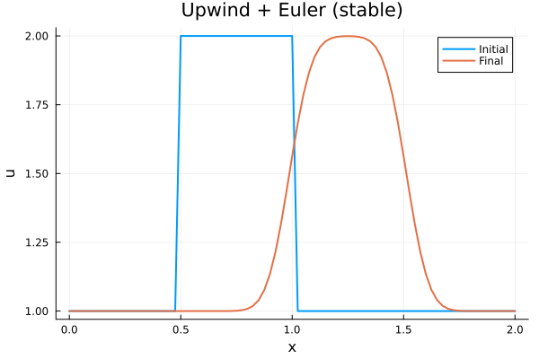
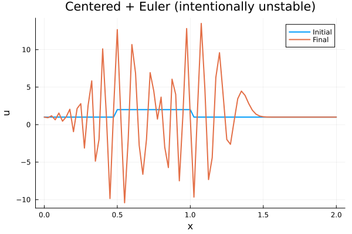

::: {.course-position}
第5回・課題 2/2 · 課題ID: N01
:::

## 目的

Julia以外のプログラミング経験はあるものの構文を忘れている学習者が、最初の偏微分方程式コードを一つのファイルで追い、upwind + Eulerとcentered + Eulerを同じ条件で比較します。式と配列の対応は[授業ページ](../lessons/N01.qmd)で順に確認します。

## このページの進め方

1. 先に[授業ページ](../lessons/N01.qmd)を上から読み、短いJulia例をコピー実行する。
2. この課題ページで、3つのTODO、実行・テスト、公式出力、完了条件を確認する。
3. 最後に学生リポジトリの`TASK.md`、`run.jl`、提供テストの順に読み、`run.jl`の3つのTODOだけを実装する。

## 課題リポジトリ内の場所

- 課題契約: `exercises/N01_linear_advection/TASK.md`
- 実装・実行: `exercises/N01_linear_advection/run.jl`
- 提供テスト: `test/provided/N01.jl`
- 自分のテスト: `test/student/N01.jl`
- 学習ログ: `learning_logs/N01.md`

## 開始

F03をmergeし、更新済みでcleanな`main`から始めます。

```bash
julia --project=. scripts/course.jl start N01
```

## 実装範囲

`run.jl`は上から順に読みます。学生が実装するのは、次の3つのTODOだけです。

1. 背景1、`0.5 <= x <= 1.0`で2となる矩形初期条件
2. 正の速度に対する後退差分のupwind + Euler更新
3. 中心差分のcentered + Euler更新

後続課題で再利用する処理は段階的に`src/`へ切り出しますが、N01は`src/`をimportしません。
TOML、Plots、`module`、`export`、境界条件、時間loop、詳細な入力検証、TOML出力、作図、`main`は提供済みです。これらの内部処理を実装できることは学習対象ではありません。関数名、引数、scheme、出力ファイル名、summaryのキーは変更しません。

## 実行とテスト

```bash
julia --project=. exercises/N01_linear_advection/run.jl
julia --project=. -e 'using Pkg; Pkg.test()'
```

公式出力は次の3ファイルです。

- `results/N01/upwind.png`
- `results/N01/centered-euler.png`
- `results/N01/summary.toml`

{fig-alt="upwind + Eulerで移流した矩形波"}

{fig-alt="centered + Eulerで発生する数値振動"}

## 次へ進む条件

- 授業ページの小さな例を実行し、式と配列添字の対応を確認した。
- 学生リポジトリで編集する3つのTODOと、変更しない提供部分を区別できる。
- 実行コマンド、3つの公式出力、提供テスト、自分のテストを確認した。

## 完了条件

- 3つのTODOを式・添字・コードで説明できる。
- 実効CFLと最終時刻を確認した。
- upwindの有界性とcentered + Eulerのovershootまたはundershootを確認した。
- 公式出力、提供テスト、自分の代表テスト、学習ログを確認した。
- diff、commit、push、PR、Actions、セルフレビュー、mergeを確認した。
