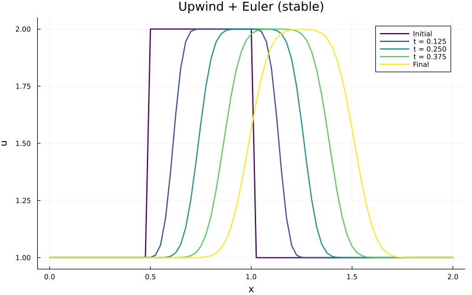
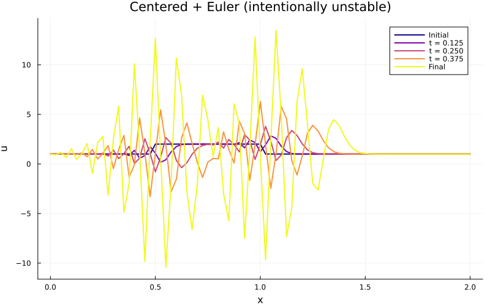

::: {.course-position}
第6回・課題 2/2 · 課題ID: N01
:::



## 定式化と実装条件 {#formulation}

### 目的 {#目的}

1次元線形移流方程式の数値計算を実装し，上流差分法 + Euler法と中心差分法 + Euler法を同じ条件で比較します．
数値手法の導出と安定性の解説は[N01授業](../lessons/N01.qmd)で学びます．
取り組む方程式は
$$
\frac{\partial u}{\partial t}+c\frac{\partial u}{\partial x}=0.
$$

branch，テスト，学習ログ，PR，mergeの共通手順は[学生向け課題ワークフロー](../guides/workflow.qmd)を参照してください．

### 問題設定と標準条件 {#problem-setup}

未知量$u$，座標$x$，時刻$t$は無次元量です．
領域は$0\le x\le2$，速度は$c=1>0$，最終時刻は$t_f=0.5$とします．
初期条件と境界条件は
$$
\begin{gathered}
u(x,0)=\begin{cases}2&0.5\le x\le1,\\1&\text{それ以外},\end{cases}\\
u(0,t)=1,\qquad \left.\frac{\partial u}{\partial x}\right|_{x=2}=0.
\end{gathered}
$$

格子は両端を含む$n_x=81$点で，$x_i=(i-1)\Delta x$，$\Delta x=2/(n_x-1)=0.025$，$i=1,\ldots,n_x$です．
境界の実装は$u_1=1$，$u_{n_x}=u_{n_x-1}$とし，内部点の更新後に適用します．

#### 離散化と時間刻み {#discretization}

同じ旧配列から内部点$i=2,\ldots,n_x-1$の新値を求めます．
$C=c\Delta t/\Delta x$として，上流差分と中心差分の更新式は，それぞれ
$$
u_i^{n+1}=u_i^n-C(u_i^n-u_{i-1}^n),
$$
$$
u_i^{n+1}=u_i^n-\frac C2(u_{i+1}^n-u_{i-1}^n).
$$

指定CFLは0.5で，$\Delta t_{\max}=0.5\Delta x/c$，$N_t=\lceil t_f/\Delta t_{\max}\rceil$，$\Delta t=t_f/N_t$とします．
標準条件では$N_t=40$，$\Delta t=0.0125$です．
上流差分の安定条件は$0<C\le1$で，中心差分＋前進Eulerはこの比較でも不安定です．
両手法を同じ格子と刻みで進め，新配列へ境界条件を適用してからバッファを交換します．

保存・表示時刻は$t=0,0.125,0.250,0.375,0.5$です．
最終時刻への到達は`isapprox(steps * dt, t_final; atol=100eps())`で確認します．

## 学生リポジトリ内の場所

- 実装・実行: [`exercises/N01_linear_advection/run.jl`](https://github.com/t2lab-it/thermofluid-exercise-student-2026/blob/main/exercises/N01_linear_advection/run.jl)
- 提供済みの補助ファイル: [`exercises/N01_linear_advection/provided_support.jl`](https://github.com/t2lab-it/thermofluid-exercise-student-2026/blob/main/exercises/N01_linear_advection/provided_support.jl)
- 必須・自作テスト: [`exercises/N01_linear_advection/tests.jl`](https://github.com/t2lab-it/thermofluid-exercise-student-2026/blob/main/exercises/N01_linear_advection/tests.jl)
- 学習ログ: `exercises/N01_linear_advection/learning_log.md`

## 開始

F03-F04をmergeし，更新済みで変更のない`main`から始めます．
[課題の開始手順](../guides/workflow.qmd#start-exercise)の`TASK_ID`を`N01`へ置き換えてください．

## 実装範囲

[`run.jl`](https://github.com/t2lab-it/thermofluid-exercise-student-2026/blob/main/exercises/N01_linear_advection/run.jl)は冒頭にある[`rectangular_initial_condition`](https://github.com/t2lab-it/thermofluid-exercise-student-2026/blob/main/exercises/N01_linear_advection/run.jl#L45-L60) → [`upwind_step!`](https://github.com/t2lab-it/thermofluid-exercise-student-2026/blob/main/exercises/N01_linear_advection/run.jl#L87-L103) / [`centered_step!`](https://github.com/t2lab-it/thermofluid-exercise-student-2026/blob/main/exercises/N01_linear_advection/run.jl#L130-L146) → [`apply_boundary!`](https://github.com/t2lab-it/thermofluid-exercise-student-2026/blob/main/exercises/N01_linear_advection/run.jl#L164-L170) → [`simulate`](https://github.com/t2lab-it/thermofluid-exercise-student-2026/blob/main/exercises/N01_linear_advection/run.jl#L197-L246) → [`main`](https://github.com/t2lab-it/thermofluid-exercise-student-2026/blob/main/exercises/N01_linear_advection/run.jl#L308-L323)の順に読みます．
学生が実装するのは，次の3つのTODOだけです．

1. [`rectangular_initial_condition`](https://github.com/t2lab-it/thermofluid-exercise-student-2026/blob/main/exercises/N01_linear_advection/run.jl#L45-L60)：[本課題の矩形初期条件](#problem-setup)を配列へ設定する．
2. [`upwind_step!`](https://github.com/t2lab-it/thermofluid-exercise-student-2026/blob/main/exercises/N01_linear_advection/run.jl#L87-L103)：[上流差分 + Euler法](#discretization)による更新．
3. [`centered_step!`](https://github.com/t2lab-it/thermofluid-exercise-student-2026/blob/main/exercises/N01_linear_advection/run.jl#L130-L146)：[中心差分 + Euler法](#discretization)による更新．

実効CFL・極値と，[`summary_section`](https://github.com/t2lab-it/thermofluid-exercise-student-2026/blob/main/exercises/N01_linear_advection/run.jl#L262-L281)のオーバーシュート・アンダーシュートの計算も[`run.jl`](https://github.com/t2lab-it/thermofluid-exercise-student-2026/blob/main/exercises/N01_linear_advection/run.jl)で確認します．
[`main`](https://github.com/t2lab-it/thermofluid-exercise-student-2026/blob/main/exercises/N01_linear_advection/run.jl#L308-L323)は二つの[`simulate`](https://github.com/t2lab-it/thermofluid-exercise-student-2026/blob/main/exercises/N01_linear_advection/run.jl#L197-L246)を実行し，提供済みの[`write_summary`](https://github.com/t2lab-it/thermofluid-exercise-student-2026/blob/main/exercises/N01_linear_advection/provided_support.jl#L142-L157)と[`make_plots`](https://github.com/t2lab-it/thermofluid-exercise-student-2026/blob/main/exercises/N01_linear_advection/provided_support.jl#L174-L198)へ結果を渡して，下の3つの公式出力を作ります．
[`apply_boundary!`](https://github.com/t2lab-it/thermofluid-exercise-student-2026/blob/main/exercises/N01_linear_advection/run.jl#L164-L170)と時間ループは提供済みです．
[`provided_support.jl`](https://github.com/t2lab-it/thermofluid-exercise-student-2026/blob/main/exercises/N01_linear_advection/provided_support.jl)には入力検証・TOML保存・描画の詳細があります．
配布された関数の呼び出し方と出力形式を保って実装してください．

## 実行とテスト

[共通の実行手順](../guides/workflow.qmd#exercise-work)で[`run.jl`](https://github.com/t2lab-it/thermofluid-exercise-student-2026/blob/main/exercises/N01_linear_advection/run.jl)を実行すると，次の3ファイルが生成されます．
内容を確認し，[公式出力の配置・サイズの確認](../guides/workflow.qmd#official-results)を行ってください．

~~~text
exercises/N01_linear_advection/results/upwind.png
exercises/N01_linear_advection/results/centered-euler.png
exercises/N01_linear_advection/results/summary.toml
~~~

図中の`Initial`は初期値，`Final`は最終値です．
[冒頭で指定した時刻](#formulation)の分布を重ね，時刻順に色が連続に変化するカラーマップを使います．
`upwind.png`は`viridis`，`centered-euler.png`は`plasma`で，時刻の順序を色の順序として読み取れます．
`Upwind`は上流差分，`Centered`は中心差分を表します．
次を確認してください．

- PNGが開き，`summary.toml`の値が同じ実行結果と一致する．
- 上流差分法の最小・最大が初期範囲内に収まり，中心差分法 + Euler法にオーバーシュートまたはアンダーシュートがある．
- 実効CFLと最終時刻が[冒頭の条件](#discretization)を満たす．

具体的な値は，下の[公開基準値](#reference-results)と比べます．

## 公開基準値との比較 {#reference-results}

まず，最小値と最大値の**符号**，初期値に対する**範囲**，オーバーシュート・アンダーシュートの**フラグ**を比べます．
数値の差は，丸め誤差を考慮して比較してください．
これにより，計算方法や境界条件の大きな違いを，丸め誤差の違いと混同しにくくなります．

次の値は，[本課題の標準条件](#problem-setup)に対応する公開基準値です．

::: {.table-responsive tbl-colwidths="[24, 19, 19, 19, 19]"}
| 手法 | `minimum` | `maximum` | `overshoot` | `undershoot` |
|---|---:|---:|---:|---:|
| upwind + Euler | 1.0 | 1.9993204517450067 | 0.0 | 0.0 |
| 中心差分 + Euler | -10.420010468371677 | 13.492726642559711 | 11.492726642559711 | 11.420010468371677 |
:::

{fig-alt="初期値から時刻0.125，0.250，0.375，0.5までをviridisの連続色で示した上流差分法とEuler法のグラフ"}

{fig-alt="初期値から時刻0.125，0.250，0.375，0.5までをplasmaの連続色で示し，振動の増幅を表した中心差分法とEuler法のグラフ"}

真偽フラグを含む機械可読な値は[`summary.toml`](../assets/n01-reference/summary.toml)でも確認できます．

## [`tests.jl`](https://github.com/t2lab-it/thermofluid-exercise-student-2026/blob/main/exercises/N01_linear_advection/tests.jl)と学習ログ

[`exercises/N01_linear_advection/tests.jl`](https://github.com/t2lab-it/thermofluid-exercise-student-2026/blob/main/exercises/N01_linear_advection/tests.jl)の五つの必須TODOで，次を確かめてください．
課題単独のテストと，現在課題・通過済みの課題をまとめるテストは[学生向け課題ワークフローの「テスト」](../guides/workflow.qmd#tests)に従って実行します．

1. 矩形初期条件
2. 上流差分後の配列全体
3. 中心差分後の配列全体
4. 境界条件後の配列全体
5. 安定・不安定計算の比較

入力，関数呼び出し，手計算した期待値または比較の判定基準は自分で書きます．

自作TODOでは，必須とは異なる初期条件，CFL，格子数，またはAPIの性質を一つ選びます．

学習ログには，そのテストの検証範囲と限界を記録します．
また，`u_old, u_new = u_new, u_old`による参照の交換のしくみと，新旧に独立した配列を使う理由を書いてください．



## 完了条件

- [理解度チェック](#understanding-check)の対話全文をLETUSへ提出し，学習ログに提出状況を記録した．
- 3つのTODOを式・添字・コードで説明できる．
- 実効CFLと最終時刻を確認した．
- 上流差分法の有界性と中心差分法 + Euler法のオーバーシュートまたはアンダーシュートを確認した．
- 初期・中間・最終時刻の分布を連続したカラーマップで読み取り，時刻による波形の変化を説明した．
- 公式出力，五つの必須テスト，一つの自作テスト，学習ログを確認した．
- [学習ログ，diff，commit](../guides/workflow.qmd#commit)から[merge後](../guides/workflow.qmd#after-merge)までを完了した．
