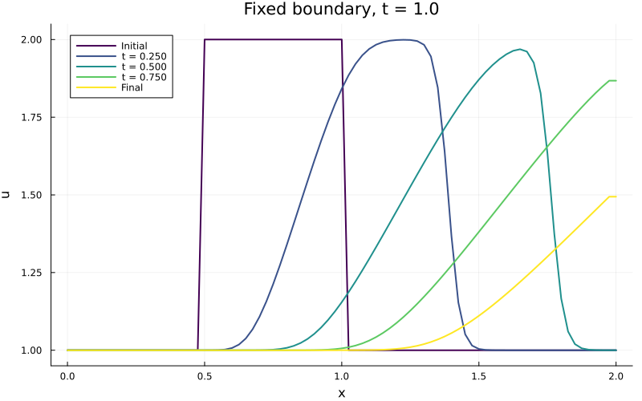
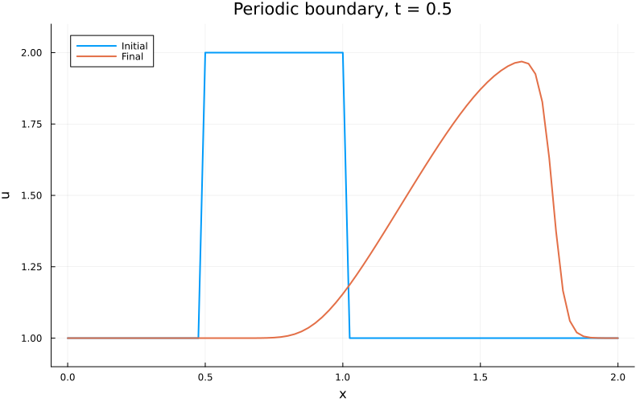

::: {.course-position}
第6回・課題 · 課題ID: N02
:::

## 取り組む課題

[N02授業](../lessons/N02.qmd)の内容を使って，以下に取り組みます．

[授業で定義した問題・標準条件](../lessons/N02.qmd#problem-setup)を実装し，固定・周期境界の数値結果を比較します．

## 編集する3ファイルと実装3箇所

| 役割 | 学生リポジトリ内の場所 |
|---|---|
| 実装・実行 | [`exercises/N02_nonlinear_advection/run.jl`](https://github.com/t2lab-it/thermofluid-exercise-student-2026/blob/main/exercises/N02_nonlinear_advection/run.jl) |
| 必須4群・自作2つ | [`exercises/N02_nonlinear_advection/tests.jl`](https://github.com/t2lab-it/thermofluid-exercise-student-2026/blob/main/exercises/N02_nonlinear_advection/tests.jl) |
| 記録 | `exercises/N02_nonlinear_advection/learning_log.md` |

[`run.jl`](https://github.com/t2lab-it/thermofluid-exercise-student-2026/blob/main/exercises/N02_nonlinear_advection/run.jl)の次の3箇所を実装してください．
関数は，[`burgers_flux`](https://github.com/t2lab-it/thermofluid-exercise-student-2026/blob/main/exercises/N02_nonlinear_advection/run.jl#L8-L13) → [`periodic_left_index`](https://github.com/t2lab-it/thermofluid-exercise-student-2026/blob/main/exercises/N02_nonlinear_advection/run.jl#L15-L23) → [`nonlinear_upwind_step!`](https://github.com/t2lab-it/thermofluid-exercise-student-2026/blob/main/exercises/N02_nonlinear_advection/run.jl#L26-L38) → [`apply_boundary!`](https://github.com/t2lab-it/thermofluid-exercise-student-2026/blob/main/exercises/N02_nonlinear_advection/run.jl#L40-L52) → [`simulate`](https://github.com/t2lab-it/thermofluid-exercise-student-2026/blob/main/exercises/N02_nonlinear_advection/run.jl#L54-L79) → [`main`](https://github.com/t2lab-it/thermofluid-exercise-student-2026/blob/main/exercises/N02_nonlinear_advection/run.jl#L81-L90)の順に読みます．

1. [`burgers_flux(u::Real)`](https://github.com/t2lab-it/thermofluid-exercise-student-2026/blob/main/exercises/N02_nonlinear_advection/run.jl#L8-L13)：有限なスカラーの流束 $u^2/2$．
2. [`periodic_left_index(i::Integer,n::Integer)`](https://github.com/t2lab-it/thermofluid-exercise-student-2026/blob/main/exercises/N02_nonlinear_advection/run.jl#L15-L23)：周期配列の左隣添字．
3. [`nonlinear_upwind_step!(u_new,u_old,dt,dx; boundary=:fixed)`](https://github.com/t2lab-it/thermofluid-exercise-student-2026/blob/main/exercises/N02_nonlinear_advection/run.jl#L26-L38)内の流束差分による更新式．

## 必須4群と指定テーマの自作2つ

[共通のテスト手順](../guides/workflow.qmd#tests)で課題単独と過去課題を含むテストを実行します．
[`tests.jl`](https://github.com/t2lab-it/thermofluid-exercise-student-2026/blob/main/exercises/N02_nonlinear_advection/tests.jl)に実装済なのは以下の4件です．

1. **流束と周期添字**：異なる値の流束の手計算値，先頭と先頭以外の周期左隣添字
2. **保存形1ステップと旧配列不変**：非定数の小配列の更新結果を手計算値と比較し，旧配列が変わらないことを確認する
3. **定数場と境界条件**：固定境界と整合する定数1，周期の別の非負定数，左右境界を適用した配列全体
4. **CFL・有界性・非線形な波形変形**：標準条件での固定・周期の実効CFL，有界性，N01の一定速度による平行移動とは異なる波形変形

配布された必須テストの入力と期待値を読み，何を確かめているか説明してください．
自作テストには次の2件を実装し，未記入の`@test false`を置き換えます．

- **周期総和保存**：非定数・非負配列を複数ステップ進め，初期総和と比較する．
  点数・ステップ数・値の大きさ・浮動小数の丸め誤差を踏まえて許容誤差を決める．
- **循環移動と更新の整合**：周期1ステップを`S`として，`S(circshift(u,k)) ≈ circshift(S(u),k)`を比較する．
  非対称な非定数配列，0でない移動量，同じ`dt,dx`を使う．
  固定境界には適用しない．

学習ログには各自作テストの入力，期待値，判定，許容誤差の根拠，検出できる／できない誤りを残します．

## 公式出力

[共通の実行手順](../guides/workflow.qmd#exercise-work)で[`run.jl`](https://github.com/t2lab-it/thermofluid-exercise-student-2026/blob/main/exercises/N02_nonlinear_advection/run.jl)を実行すると，次の3点が生成されます．

~~~text
exercises/N02_nonlinear_advection/results/fixed-boundary.png
exercises/N02_nonlinear_advection/results/periodic.png
exercises/N02_nonlinear_advection/results/summary.toml
~~~

可視化には初期値`Initial`と最終値`Final`を重ねて表示します．
[公式出力の確認](../guides/workflow.qmd#official-results)を行って3点をcommitします．
実行に失敗した場合は，原因を直して再実行し，成功メッセージと3点の出力を確認してください．

任意の[CFLを変える追加実験](../lessons/N02.qmd#comparison-conditions)では，Juliaで[`run.jl`](https://github.com/t2lab-it/thermofluid-exercise-student-2026/blob/main/exercises/N02_nonlinear_advection/run.jl)を読み込んで次のように実行できます．
比較する二つの出力は，それぞれ別の一時ディレクトリに保存されます．

```julia
include("exercises/N02_nonlinear_advection/run.jl")
N02NonlinearAdvection.main(; cfl=0.5, t_final=0.1, output_dir=mktempdir())
N02NonlinearAdvection.main(; cfl=2.0, t_final=0.1, output_dir=mktempdir())
```

指定CFLが1を超えても計算は続行しますが，値が非有限になると停止します．
その場合は比較する両方の最終時刻を同じだけ短くし，使った条件と停止時の状況を学習ログに記録してください．

## 公開基準値との比較 {#reference-results}

公式出力は[授業の標準条件](../lessons/N02.qmd#problem-setup)で生成し，以下と比較してください．

{fig-alt="固定境界，時刻1.0で波の一部が右端から流出し，左側は初期の低い値を保つ分布"}

{fig-alt="周期境界，時刻1.0で右端を越えた波が左側へ戻った分布．右端は表示用の先頭値で閉じている"}

左側へ戻る波の有無に注目し，固定境界と周期境界の違いを説明してください．
数値拡散によるなまりと，非線形な波形変形を区別してください．
N01との波形比較は[授業の比較条件](../lessons/N02.qmd#comparison-conditions)で実行してください．
[`summary.toml`](../assets/n02-reference/summary.toml)をAIに読ませて，自身が実装した結果と比較してください．
`max_cfl`は全状態の最大実測値，`overshoot`と`undershoot`は初期極値を超えた量（超過なしなら0），`sum_change`は最終総和から初期総和を引いた符号付きの値です．



## 完了条件

- [理解度チェック](#understanding-check)の対話全文をLETUSへ提出し，学習ログに提出状況を記録した．
- 流束と更新式を式・配列・コードで説明し，周期添字を含む3箇所を実装した．
- 必須4群と指定テーマ自作2つが通り，過去課題の回帰も通る．
  各テストの根拠と限界を説明できる．
- 固定・周期の格子，時間刻み，最終時刻，CFL，有界性，周期総和，固定・周期境界の違いとN01との波形の違いを確認した．
- 公式3出力と学習ログを確認し，[学習ログ・diff・commit](../guides/workflow.qmd#commit)から[merge後](../guides/workflow.qmd#after-merge)まで完了した．
