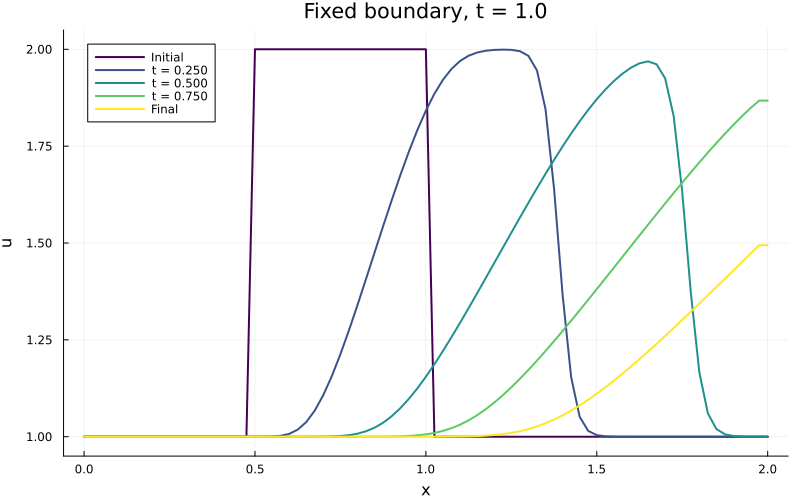
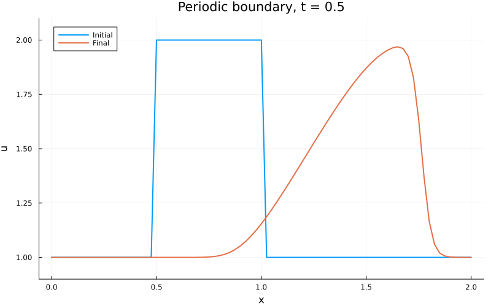

::: {.course-position}
第6回・課題 · 課題ID: N02
:::



## 定式化と実装条件 {#formulation}

### 取り組む課題 {#取り組む課題}

[N02授業](../lessons/N02.qmd)の内容を使って，以下に取り組みます．

取り組む方程式は，保存形の非粘性Burgers方程式
$$
\frac{\partial u}{\partial t}+\frac{\partial f(u)}{\partial x}=0,
\qquad f(u)=\frac{u^2}{2}.
$$

[下の問題設定・標準条件](#problem-setup)を実装し，固定・周期境界の数値結果を比較します．

### 問題設定と標準条件 {#problem-setup}

未知量$u$は非負の無次元速度で，$x,t$も無次元です．
最終時刻は$t_f=1$，指定CFLは0.5，初期条件は次の矩形
$$
u(x,0)=\begin{cases}2&0.5\le x\le1,\\1&\text{それ以外}.\end{cases}
$$

::: {.table-responsive}
| 境界の指定 | 領域・格子 | 境界条件・更新対象 |
|---|---|---|
| `:fixed` | $[0,2]$の端点を含む81点，$\Delta x=2/(n_x-1)$ | 左$u=1$，右$\frac{\partial u}{\partial x}=0$；内部$i=2,\ldots,n_x-1$ |
| `:periodic` | $[0,2)$の80点，$\Delta x=2/n_x$ | $u(x+2,t)=u(x,t)$；全点$i=1,\ldots,n_x$ |
:::

座標は両方とも$x_i=(i-1)\Delta x$です．
固定境界では内部更新後に$u_1=1$，$u_{n_x}=u_{n_x-1}$を設定します．
周期左隣は$i=1$で$n_x$，それ以外で$i-1$です．

#### 離散化と時間刻み {#discretization}

非負速度に対する左側の保存形上流流束を使い，全更新を同じ旧配列から計算します．
周期では下式の$i-1$を周期左隣に置き換えます．
更新式は
$$
\begin{aligned}
u_i^{n+1}=u_i^n&-\frac{\Delta t}{\Delta x}\\
&\cdot\left(\frac{(u_i^n)^2}{2}-\frac{(u_{i-1}^n)^2}{2}\right).
\end{aligned}
$$

$a_0=\max_i|u_i^0|=2$，$\Delta t_{\max}=0.5\Delta x/a_0$，$N_t=\lceil t_f/\Delta t_{\max}\rceil$，$\Delta t=t_f/N_t$とします．
両格子の標準刻みは$\Delta t=0.00625$，160ステップです．
この一定の刻みを使い，初期・各更新後の$C_n=\max_i|u_i^n|\Delta t/\Delta x$の最大を記録します．
標準計算では$C_n\le1$と$1\le u\le2$を確認します．
周期境界では，積分$I_h=\Delta x\sum_i u_i$が保存されます．
N01との波形比較は，固定境界・同じ矩形初期値・81点・指定CFL 0.5・最終時刻1に揃え，N01の定速度は$c=1$とします．
任意の安定条件超過実験は固定境界・81点・最終時刻0.1で，指定CFL 0.5と2を比べます．

保存・表示時刻は$t=0,0.25,0.50,0.75,1$です．
`max_cfl`は全状態の最大実測値，`overshoot`と`undershoot`は初期極値を超えた量（超過なしなら0），`sum_change`は最終総和から初期総和を引いた符号付きの値です．

## 編集する3ファイルと実装3箇所

::: {.table-responsive}
| 役割 | 学生リポジトリ内の場所 |
|---|---|
| 実装・実行 | [`exercises/N02_nonlinear_advection/run.jl`](https://github.com/t2lab-it/thermofluid-exercise-student-2026/blob/main/exercises/N02_nonlinear_advection/run.jl) |
| 必須4群・自作2つ | [`exercises/N02_nonlinear_advection/tests.jl`](https://github.com/t2lab-it/thermofluid-exercise-student-2026/blob/main/exercises/N02_nonlinear_advection/tests.jl) |
| 記録 | `exercises/N02_nonlinear_advection/learning_log.md` |
:::
: {tbl-colwidths="[24, 76]"}

[`run.jl`](https://github.com/t2lab-it/thermofluid-exercise-student-2026/blob/main/exercises/N02_nonlinear_advection/run.jl)の次の3箇所を実装してください．
関数は，[`burgers_flux`](https://github.com/t2lab-it/thermofluid-exercise-student-2026/blob/main/exercises/N02_nonlinear_advection/run.jl#L28-L32) → [`periodic_left_index`](https://github.com/t2lab-it/thermofluid-exercise-student-2026/blob/main/exercises/N02_nonlinear_advection/run.jl#L55-L60) → [`nonlinear_upwind_step!`](https://github.com/t2lab-it/thermofluid-exercise-student-2026/blob/main/exercises/N02_nonlinear_advection/run.jl#L87-L99) → [`apply_boundary!`](https://github.com/t2lab-it/thermofluid-exercise-student-2026/blob/main/exercises/N02_nonlinear_advection/run.jl#L117-L126) → [`simulate`](https://github.com/t2lab-it/thermofluid-exercise-student-2026/blob/main/exercises/N02_nonlinear_advection/run.jl#L151-L206) → [`main`](https://github.com/t2lab-it/thermofluid-exercise-student-2026/blob/main/exercises/N02_nonlinear_advection/run.jl#L227-L239)の順に読みます．

1. [`burgers_flux(u::Real)`](https://github.com/t2lab-it/thermofluid-exercise-student-2026/blob/main/exercises/N02_nonlinear_advection/run.jl#L28-L32)：有限なスカラーの流束 $u^2/2$．
2. [`periodic_left_index(i::Integer,n::Integer)`](https://github.com/t2lab-it/thermofluid-exercise-student-2026/blob/main/exercises/N02_nonlinear_advection/run.jl#L55-L60)：周期配列の左隣添字．
3. [`nonlinear_upwind_step!(u_new,u_old,dt,dx; boundary=:fixed)`](https://github.com/t2lab-it/thermofluid-exercise-student-2026/blob/main/exercises/N02_nonlinear_advection/run.jl#L87-L99)内の流束差分による更新式．

## 必須4群と指定テーマの自作2つ

[共通のテスト手順](../guides/workflow.qmd#tests)で課題単独と過去課題を含むテストを実行します．
[`tests.jl`](https://github.com/t2lab-it/thermofluid-exercise-student-2026/blob/main/exercises/N02_nonlinear_advection/tests.jl)に実装済なのは以下の4件です．

1. **流束と周期添字**：異なる値の流束の手計算値，先頭と先頭以外の周期左隣添字
2. **保存形1ステップと旧配列不変**：非定数の小配列の更新結果を手計算値と比較し，旧配列の値が保持されることを確認する
3. **定数場と境界条件**：固定境界と整合する定数1，周期の別の非負定数，左右境界を適用した配列全体
4. **CFL・有界性・非線形な波形変形**：標準条件での固定・周期の実効CFL，有界性，N01の一定速度による平行移動とは異なる波形変形

配布された必須テストの入力と期待値を読み，何を確かめているか説明してください．
自作テストには次の2件を実装し，未記入の`@test false`を置き換えます．

- **周期総和保存**：非定数・非負配列を複数ステップ進め，初期総和と比較する．
  点数・ステップ数・値の大きさ・浮動小数の丸め誤差を踏まえて許容誤差を決める．
- **循環移動と更新の整合**：周期1ステップを`S`として，`S(circshift(u,k)) ≈ circshift(S(u),k)`を比較する．
  非対称な非定数配列，1点以上の循環移動，同じ`dt,dx`を使う．

学習ログには各自作テストの入力，期待値，判定，許容誤差の根拠，検証範囲と限界を残します．

## 公式出力

[共通の実行手順](../guides/workflow.qmd#exercise-work)で[`run.jl`](https://github.com/t2lab-it/thermofluid-exercise-student-2026/blob/main/exercises/N02_nonlinear_advection/run.jl)を実行すると，次の3点が生成されます．

~~~text
exercises/N02_nonlinear_advection/results/fixed-boundary.png
exercises/N02_nonlinear_advection/results/periodic.png
exercises/N02_nonlinear_advection/results/summary.toml
~~~

可視化には[冒頭で指定した時刻](#formulation)の分布を重ね，初期値を`Initial`，最終値を`Final`と表示します．
各曲線には時刻順に連続なカラーマップ（`viridis`など）を割り当て，初期条件から最終時刻まで色が連続に変化するようにします．
[公式出力の確認](../guides/workflow.qmd#official-results)を行って3点をcommitします．
実行に失敗した場合は，原因を直して再実行し，成功メッセージと3点の出力を確認してください．

任意の[安定条件超過実験](#formulation)では，Juliaで[`run.jl`](https://github.com/t2lab-it/thermofluid-exercise-student-2026/blob/main/exercises/N02_nonlinear_advection/run.jl)を読み込んで次のように実行できます．
比較する二つの出力は，それぞれ別の一時ディレクトリに保存されます．

```julia
include("exercises/N02_nonlinear_advection/run.jl")
N02NonlinearAdvection.main(; cfl=0.5, t_final=0.1, output_dir=mktempdir())
N02NonlinearAdvection.main(; cfl=2.0, t_final=0.1, output_dir=mktempdir())
```

## 公開基準値との比較 {#reference-results}

公式出力は[本課題の標準条件](#problem-setup)で生成し，以下と比較してください．

{fig-alt="固定境界，初期から時刻0.25，0.50，0.75，1.0までを連続した色で示した非線形移流の分布．時刻1.0では波の一部が右端から流出し，左側は初期の低い値を保つ"}

{fig-alt="周期境界，初期から時刻0.25，0.50，0.75，1.0までを連続した色で示した非線形移流の分布．時刻1.0では右端を越えた波が左側へ戻り，右端は表示用の先頭値で閉じている"}

左側へ戻る波の有無に注目し，固定境界と周期境界の違いを説明してください．
数値拡散によるなまりと，非線形な波形変形を区別してください．
N01との波形比較も[本課題の比較条件](#problem-setup)で実行してください．
[`summary.toml`](../assets/n02-reference/summary.toml)をAIに読ませて，自身が実装した結果と比較してください．
診断値の定義は[冒頭の条件](#formulation)を参照し，図と照合してください．



## 完了条件

- [理解度チェック](#understanding-check)の対話全文をLETUSへ提出し，学習ログに提出状況を記録した．
- 流束と更新式を式・配列・コードで説明し，周期添字を含む3箇所を実装した．
- 必須4群と指定テーマ自作2つが通り，過去課題の回帰も通る．
  各テストの根拠と限界を説明できる．
- 固定・周期の格子，時間刻み，初期・中間・最終時刻，CFL，有界性，周期総和，固定・周期境界の違いとN01との波形の違いを確認した．
- 初期・中間・最終時刻の曲線を連続なカラーマップで表示した公式3出力と学習ログを確認し，[学習ログ・diff・commit](../guides/workflow.qmd#commit)から[merge後](../guides/workflow.qmd#after-merge)まで完了した．
