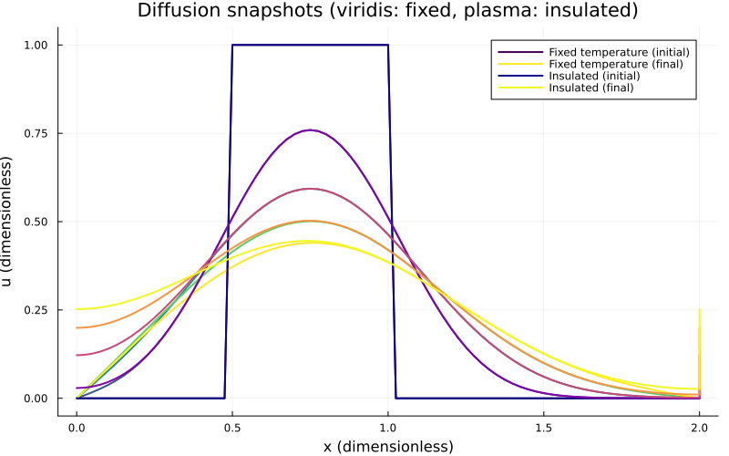
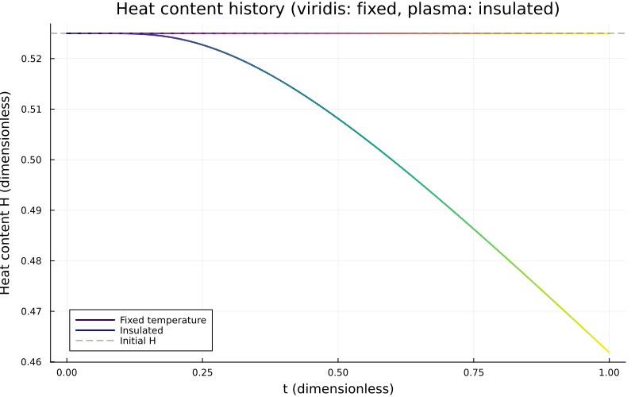
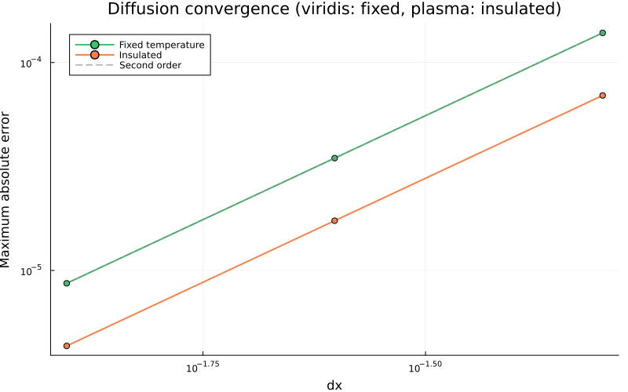

::: {.course-position}
第7回・課題 · 課題ID: N03
:::

## 取り組む課題

[N03の問題・標準条件](../lessons/N03.qmd#problem-setup)を実装し，固定温度と断熱の結果を比較します．
N02完了後に，[課題の開始](../guides/workflow.qmd#start-exercise)で課題ID`N03`を指定します．

## 編集する3ファイルと実装3箇所

| 役割 | 学生リポジトリ内の場所 |
|---|---|
| 実装・実行 | `exercises/N03_diffusion/run.jl` |
| 必須4群・自作2つ | `exercises/N03_diffusion/tests.jl` |
| 記録 | `exercises/N03_diffusion/learning_log.md` |

`run.jl`の3箇所を実装してください．

1. `diffusion_step!(u_new,u_old,dt,dx,diffusivity; boundary=:fixed)`の内部点更新．
2. `apply_boundary!(u_new,u_old,r; boundary=:fixed)`の断熱端更新．
3. `thermal_content(u,dx)`の熱量積分．

`provided_support.jl`の入力検証・描画・保存は提供済みです．
`diffusion_step!`は旧配列から内部点と境界を更新し，`simulate`が新旧バッファを交換します．
初期条件，`analytic_solution`，`simulate`，`main`も読み，数式とコードの対応を学習ログに記録します．

## 必須4群と指定テーマの自作2つ

[共通のテスト手順](../guides/workflow.qmd#tests)で課題単独と過去課題を含むテストを実行します．
配布済みの必須4群は次のとおりです．

1. 小配列の1ステップ：非対称配列の内部・両端の手計算値と旧配列不変．
2. 定数場と固定端：断熱の定数，固定の0，更新後の固定端．
3. 熱量の定義：端点が内部と異なる配列の台形則の手計算．
4. 標準計算の安定性：最終時刻，実効Fourier数，有限性，非負性，有界性．

次の2つのテストを自作してください．

- **断熱の熱量保存**：端点を含めて値が異なる非対称な非定数配列を複数ステップ進めます．
  初期熱量をテスト側でも独立に計算し，点数・ステップ数・値の大きさ・丸め誤差から許容誤差を決めます．
- **解析解と格子収束**：固定温度の正弦モードを41・81・161点で，同じ最終時刻・同じ指定Fourier数で計算します．
  [授業の解析解](../lessons/N03.qmd#convergence)との誤差の減少と観測次数を確認します．

各テストの入力，期待値，誤差指標，許容誤差とその根拠を学習ログに記します．

## 公式出力と公開基準値 {#reference-results}

[共通の実行手順](../guides/workflow.qmd#exercise-work)で`run.jl`を実行すると，標準条件の4出力を生成します．

~~~text
exercises/N03_diffusion/results/boundary-comparison.png
exercises/N03_diffusion/results/heat-content.png
exercises/N03_diffusion/results/convergence.png
exercises/N03_diffusion/results/summary.toml
~~~

[公式出力の確認](../guides/workflow.qmd#official-results)を行い，4点をcommitします．

`boundary-comparison.png`には初期分布と`t=0.25，0.50，0.75，1.0`の空間分布を重ねます．
同じ図に複数のシミュレーションを載せるため，固定温度は`viridis`，断熱は`plasma`の連続カラーマップを使います．
初期条件から最終時刻までの各系列を色の連続として読み取り，固定温度と断熱の違いを比較してください．

{fig-alt="初期矩形から時刻0.25，0.50，0.75，1.0までを連続色で示した拡散分布．固定温度はviridis，断熱はplasmaで，固定温度端は0へ近づき断熱端は温度が変化する"}

{fig-alt="全時刻の無次元熱量履歴．固定温度はviridis，断熱はplasmaで示し，固定温度では初期熱量0.525から減少し断熱では0.525を保つ"}

{fig-alt="viridisの固定温度とplasmaの断熱について，格子幅を半分にすると最大絶対誤差が約4分の1になる収束図"}

[`summary.toml`](../assets/n03-reference/summary.toml)と自分の結果を比較してください．
`initial_heat`と`final_heat`は台形則の無次元熱量，`heat_change`は最終から初期を引いた符号付き変化です．
`minimum`と`maximum`は初期を含む全時刻の極値，`requested_fo`は指定値，`fo`は実効値です．
`convergence`には両境界の格子幅・最大絶対誤差・観測次数が入ります．
図・数値から固定温度の放熱，断熱の保存，解析解への収束を説明し，N01・N02の数値拡散と物理拡散の違いも記録します．

## 任意の安定条件超過実験

実装が完成したら，[授業の比較条件](../lessons/N03.qmd#stability)を次のように試せます．

```julia
include("exercises/N03_diffusion/run.jl")
N03Diffusion.stability_experiment(; output_dir=joinpath("scratch", "N03-stability"))
```

`scratch/N03-stability/`に`stability-comparison.png`と`summary.toml`を保存します．
図から振動・振幅増大を比較し，条件と結果を学習ログへ追記します．



## 完了条件

- [理解度チェック](#understanding-check)の対話全文をLETUSへ提出し，学習ログへ提出状況を記録した．
- 実装3箇所と旧配列・境界・バッファ交換，係数2と半セルの対応を説明できる．
- 配布済み必須4群・指定テーマ自作2つ・過去課題の回帰テストが通り，判断条件の根拠を説明できる．
- 初期・中間・最終時刻の温度分布を連続カラーマップで比較し，両境界の熱量，標準計算の安定性，解析モードの格子収束を図と数値から説明した．
- 公式4出力と学習ログを確認し，[学習ログ・diff・commit](../guides/workflow.qmd#commit)から[merge後](../guides/workflow.qmd#after-merge)まで完了した．
