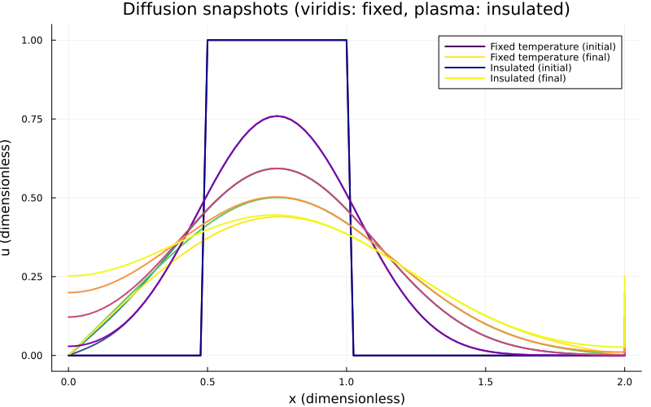
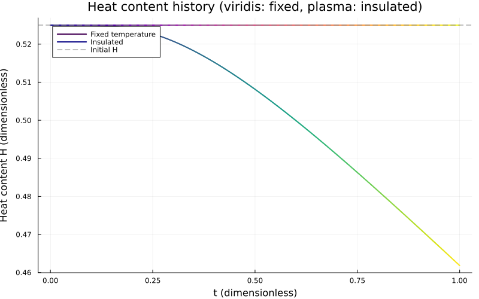
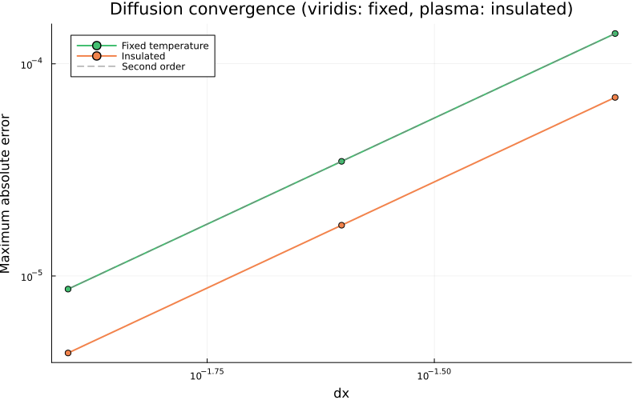

::: {.course-position}
第7回・課題 · 課題ID: N03
:::

## 定式化と実装条件 {#formulation}

### 取り組む課題 {#取り組む課題}

熱拡散と境界条件の物理的意味，差分式の導出は[N03授業](../lessons/N03.qmd)で学びます．

取り組む方程式は，一次元の熱拡散方程式
$$
\frac{\partial u}{\partial t}=D\frac{\partial^2 u}{\partial x^2}.
$$

[下の問題設定・標準条件](#problem-setup)を実装し，固定温度と断熱の結果を比較します．
N02完了後に，[課題の開始](../guides/workflow.qmd#start-exercise)で課題ID`N03`を指定します．

### 問題設定と標準条件 {#problem-setup}

未知量$u=(T-T_{\mathrm{ref}})/\Delta T$は無次元温度で，$\Delta T>0$です．
無次元座標$x=x_{\mathrm{phys}}/\ell_{\mathrm{ref}}$，時刻$t=t_{\mathrm{phys}}/t_{\mathrm{ref}}$を使い，拡散係数は$D=\alpha t_{\mathrm{ref}}/\ell_{\mathrm{ref}}^2=0.1$とします．
領域は$[0,L]$，$L=2$，最終時刻は$t_f=1$です．
端点を含む$n_x=81$点を$x_i=(i-1)\Delta x$，$\Delta x=L/(n_x-1)$に配置します．
初期条件`initial=:pulse`は次の矩形
$$
u(x,0)=\begin{cases}1&0.5\le x\le1,\\0&\text{それ以外}.\end{cases}
$$

両端を固定温度0とする`:fixed`と，両端の法線微分0とする`:insulated`を比較します．
固定温度は$u(0,t)=u(L,t)=0$，断熱は$u_x(0,t)=u_x(L,t)=0$です．

#### 離散化と時間刻み {#discretization}

内部点は中心差分＋前進Eulerの式
$$
\begin{gathered}
u_i^{n+1}=u_i^n+r(u_{i+1}^n-2u_i^n+u_{i-1}^n),\\
r=\frac{D\Delta t}{\Delta x^2}
\end{gathered}
$$
で更新します．

固定温度では更新後の両端を0にします．
断熱ではゴースト$u_0^n=u_2^n$，$u_{n_x+1}^n=u_{n_x-1}^n$を消去した次式
$$
\begin{aligned}
u_1^{n+1}&=u_1^n+2r(u_2^n-u_1^n),\\
u_{n_x}^{n+1}&=u_{n_x}^n+2r(u_{n_x-1}^n-u_{n_x}^n)
\end{aligned}
$$
で端点も更新します．

内部・端点とも同じ旧配列を参照し，新配列への書込みが終わってから交換します．
指定Fourier数は0.4で，$\Delta t_{\max}=0.4\Delta x^2/D$，$N_t=\lceil t_f/\Delta t_{\max}\rceil$，$\Delta t=t_f/N_t$です．
実効値$r$を記録し，安定条件$0<r\le1/2$を確認します．
熱量は端点を半分に重み付けする台形則で定義し，断熱では保存されます．
その定義は
$$
H_h=\Delta x\left(\frac{u_1}{2}+\sum_{i=2}^{n_x-1}u_i+\frac{u_{n_x}}2\right).
$$

#### 解析解と比較条件

`initial=:mode`では次の解析解の$t=0$を初期条件にします．
$\lambda=D(\pi/L)^2$とすると，解析解は
$$
\begin{aligned}
u_{*,\mathrm{fixed}}&=e^{-\lambda t}\sin(\pi x/L),\\
u_{*,\mathrm{insulated}}&=\tfrac12\\
&\quad+\tfrac12e^{-\lambda t}\cos(\pi x/L)
\end{aligned}
$$
です．

両境界を41・81・161点，指定Fourier数0.4，最終時刻1で比較します．
全格子点での最大絶対誤差$E=\max_i|u_i-u_*(x_i,1)|$と，両区間の$p=\log_2(E_{\mathrm{coarse}}/E_{\mathrm{fine}})$を計算し，約2次の収束を確認します．
任意の安定条件超過実験は矩形初期値・固定温度・81点・最終時刻0.1で，指定Fourier数0.4と0.6を比べます．

保存・表示時刻は$t=0,0.25,0.50,0.75,1$です．

#### 診断値の定義 {#diagnostics}

`initial_heat`と`final_heat`は台形則の無次元熱量，`heat_change`は最終から初期を引いた符号付き変化です．
`minimum`と`maximum`は初期を含む全時刻の極値，`requested_fo`は指定値，`fo`は実効値です．
`convergence`には両境界の格子幅・最大絶対誤差・観測次数が入ります．
図・数値から固定温度の放熱，断熱の保存，解析解への収束を説明し，N01・N02の数値拡散と物理拡散の違いも記録します．

## 編集する3ファイルと実装3箇所

| 役割 | 学生リポジトリ内の場所 |
|---|---|
| 実装・実行 | [`exercises/N03_diffusion/run.jl`](https://github.com/t2lab-it/thermofluid-exercise-student-2026/blob/main/exercises/N03_diffusion/run.jl) |
| 必須4群・自作2つ | [`exercises/N03_diffusion/tests.jl`](https://github.com/t2lab-it/thermofluid-exercise-student-2026/blob/main/exercises/N03_diffusion/tests.jl) |
| 記録 | `exercises/N03_diffusion/learning_log.md` |
: {tbl-colwidths="[24, 76]"}

[`run.jl`](https://github.com/t2lab-it/thermofluid-exercise-student-2026/blob/main/exercises/N03_diffusion/run.jl)の3箇所を実装してください．

1. [`diffusion_step!(u_new,u_old,dt,dx,diffusivity; boundary=:fixed)`](https://github.com/t2lab-it/thermofluid-exercise-student-2026/blob/main/exercises/N03_diffusion/run.jl#L43-L57)の内部点更新．
2. [`apply_boundary!(u_new,u_old,r; boundary=:fixed)`](https://github.com/t2lab-it/thermofluid-exercise-student-2026/blob/main/exercises/N03_diffusion/run.jl#L29-L41)の断熱端更新．
3. [`thermal_content(u,dx)`](https://github.com/t2lab-it/thermofluid-exercise-student-2026/blob/main/exercises/N03_diffusion/run.jl#L59-L69)の熱量積分．

[`provided_support.jl`](https://github.com/t2lab-it/thermofluid-exercise-student-2026/blob/main/exercises/N03_diffusion/provided_support.jl)の入力検証・描画・保存は提供済みです．
[`diffusion_step!`](https://github.com/t2lab-it/thermofluid-exercise-student-2026/blob/main/exercises/N03_diffusion/run.jl#L43-L57)は旧配列から内部点と境界を更新し，[`simulate`](https://github.com/t2lab-it/thermofluid-exercise-student-2026/blob/main/exercises/N03_diffusion/run.jl#L72-L113)が新旧バッファを交換します．
[`initial_condition`](https://github.com/t2lab-it/thermofluid-exercise-student-2026/blob/main/exercises/N03_diffusion/run.jl#L9-L16)，[`analytic_solution`](https://github.com/t2lab-it/thermofluid-exercise-student-2026/blob/main/exercises/N03_diffusion/run.jl#L18-L26)，[`simulate`](https://github.com/t2lab-it/thermofluid-exercise-student-2026/blob/main/exercises/N03_diffusion/run.jl#L72-L113)，[`main`](https://github.com/t2lab-it/thermofluid-exercise-student-2026/blob/main/exercises/N03_diffusion/run.jl#L116-L123)も読み，数式とコードの対応を学習ログに記録します．

## 必須4群と指定テーマの自作2つ

[共通のテスト手順](../guides/workflow.qmd#tests)で課題単独と過去課題を含むテストを実行します．
配布済みの必須4群は次のとおりです．

1. 小配列の1ステップ：非対称配列の内部・両端の手計算値と旧配列不変．
2. 定数場と固定端：断熱の定数，固定の0，更新後の固定端．
3. 熱量の定義：端点が内部と異なる配列の台形則の手計算．
4. 標準計算の安定性：最終時刻，実効Fourier数，有限性，非負性，有界性．

次の2つのテストを自作してください．

- **断熱の熱量保存**：端点を含めて値が異なる非対称な非定数配列を複数ステップ進めます．
  初期熱量をテスト側でも独立に計算し，点数・ステップ数・値の大きさ・丸め誤差から許容誤差を決めます．
- **解析解と格子収束**：[冒頭の解析解と比較条件](#formulation)に従って固定温度の正弦モードを計算します．
  本課題の解析解との誤差の減少と観測次数を確認します．

各テストの入力，期待値，誤差指標，許容誤差とその根拠を学習ログに記します．

## 公式出力と公開基準値 {#reference-results}

[共通の実行手順](../guides/workflow.qmd#exercise-work)で[`run.jl`](https://github.com/t2lab-it/thermofluid-exercise-student-2026/blob/main/exercises/N03_diffusion/run.jl)を実行すると，標準条件の4出力を生成します．

~~~text
exercises/N03_diffusion/results/boundary-comparison.png
exercises/N03_diffusion/results/heat-content.png
exercises/N03_diffusion/results/convergence.png
exercises/N03_diffusion/results/summary.toml
~~~

[公式出力の確認](../guides/workflow.qmd#official-results)を行い，4点をcommitします．

`boundary-comparison.png`には[冒頭で指定した時刻](#formulation)の空間分布を重ねます．
色は時刻を表し，両境界に共通の`viridis`系列から4色を使います．
線種は境界条件を表し，固定温度は実線，断熱は破線です．
初期分布は灰色点線で1本だけ示し，時刻の色と境界条件の線種は別々の凡例で確認できます．
同じ時刻の2本を比較し，境界条件による温度分布の違いを読み取ってください．

{fig-alt="灰色点線の初期分布と，時刻0.25，0.50，0.75，1.0を4色で示す単一パネルの拡散分布．同じ時刻の固定温度は実線，断熱は破線で，時刻と線種の凡例を別々に示す"}

`heat-content.png`の縦軸は無次元熱量$H$です．
固定温度は黒実線，断熱は黒破線，初期熱量は灰色点線で示します．

{fig-alt="全時刻の無次元熱量履歴．固定温度は黒実線，断熱は黒破線，初期熱量は灰色点線で示し，固定温度では初期熱量0.525から減少し断熱では0.525を保つ"}

{fig-alt="黒実線の固定温度と黒破線の断熱，黒点線の2次比較線を示し，格子幅を半分にすると最大絶対誤差が約4分の1になる収束図"}

[`summary.toml`](../assets/n03-reference/summary.toml)と自分の結果を比較してください．
診断値の定義は[冒頭の条件](#diagnostics)を参照し，図と照合してください．

## 任意の安定条件超過実験

実装が完成したら，[本課題の比較条件](#problem-setup)に対応する[`stability_experiment`](https://github.com/t2lab-it/thermofluid-exercise-student-2026/blob/main/exercises/N03_diffusion/run.jl#L126-L133)を次のように試せます．

```julia
include("exercises/N03_diffusion/run.jl")
N03Diffusion.stability_experiment(; output_dir=joinpath("scratch", "N03-stability"))
```

`scratch/N03-stability/`に`stability-comparison.png`と`summary.toml`を保存します．
図から振動・振幅増大を比較し，条件と結果を学習ログへ追記します．



## 完了条件

- [理解度チェック](#understanding-check)の対話全文をLETUSへ提出し，学習ログへ提出状況を記録した．
- 実装3箇所と旧配列・境界・バッファ交換，係数2と半セルの対応を説明できる．
- 配布済み必須4群・指定テーマ自作2つ・過去課題の回帰テストが通り，判断条件の根拠を説明できる．
- 灰色点線の初期分布と4時刻の温度分布を，時刻の色と境界条件の線種を使って比較し，両境界の熱量，標準計算の安定性，解析モードの格子収束を図と数値から説明した．
- 公式4出力と学習ログを確認し，[学習ログ・diff・commit](../guides/workflow.qmd#commit)から[merge後](../guides/workflow.qmd#after-merge)まで完了した．
