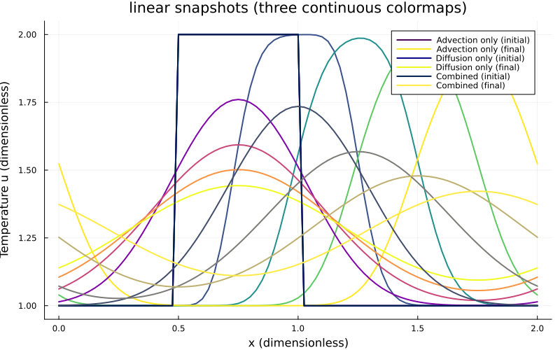
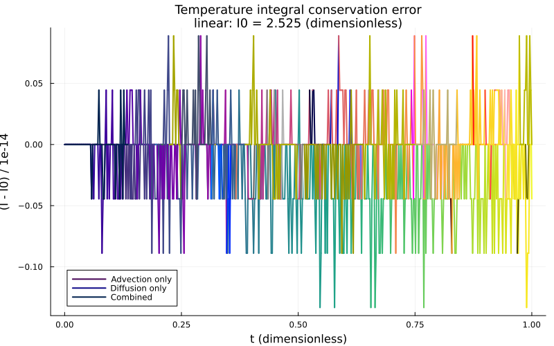
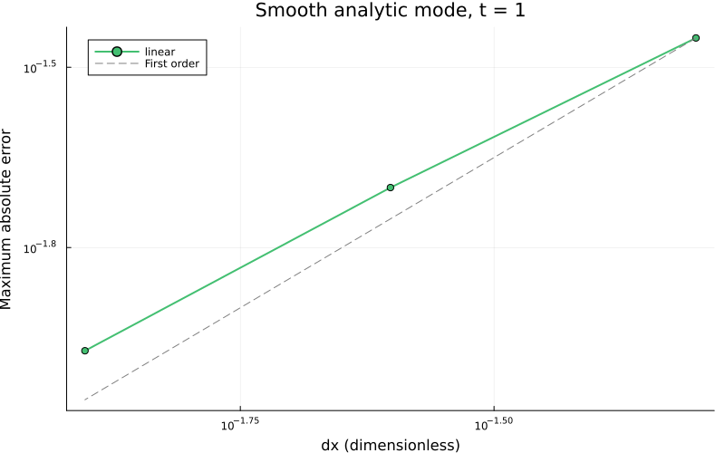
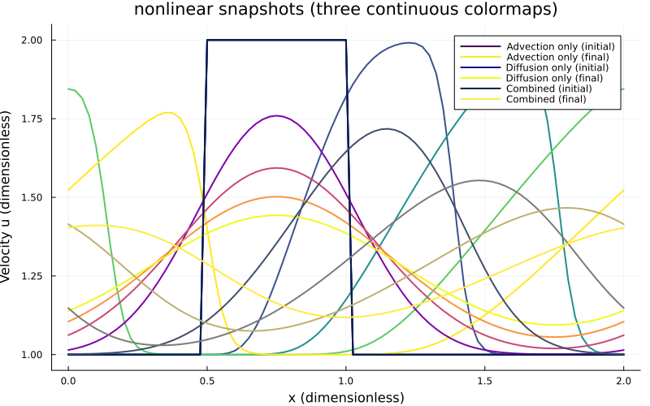
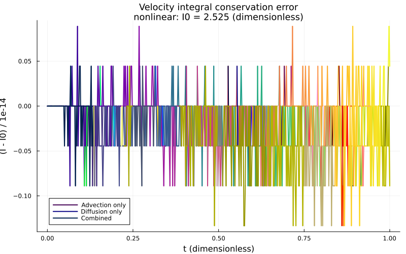
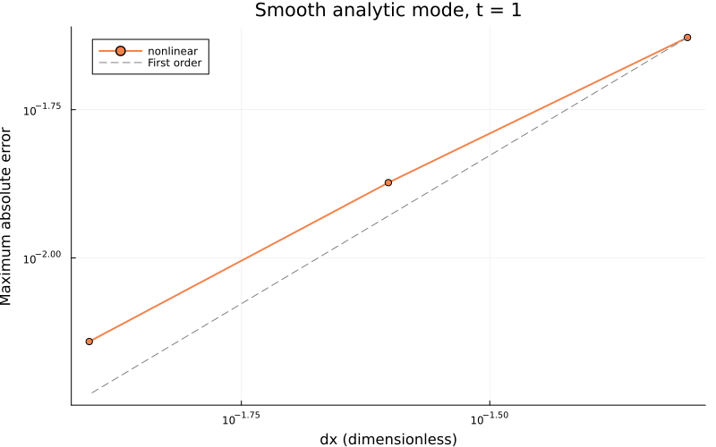

::: {.course-position}
第7回・課題 · 課題ID: N04
:::

## 選択して取り組む課題

[N04の問題・標準条件](../lessons/N04.qmd#problem-setup)について，線形または非線形を選択します．
**選択したモデルだけで必修を完了できます．**
どちらも周期境界，3条件比較，保存，解析解による精度・格子収束が必修です．
N03完了後に，[課題の開始](../guides/workflow.qmd#start-exercise)で課題ID`N04`を指定します．

## 編集対象と選択

| 役割 | 学生リポジトリ内の場所 |
|---|---|
| モデル選択・実装・実行 | `exercises/N04_advection_diffusion/run.jl` |
| 配布済み必須4群・自作2件 | `exercises/N04_advection_diffusion/tests.jl` |
| 選択理由と検証の記録 | `exercises/N04_advection_diffusion/learning_log.md` |

`run.jl`の`SELECTED_MODEL`を`:unselected`から`:linear`または`:nonlinear`へ変更してください．
選択した流束と共通の刻み・更新の3箇所を完成させます．

| 学生API | 実装・契約 |
|---|---|
| `advective_flux(u; model=SELECTED_MODEL, speed=1.0)` | 選択したモデルの流束を返す |
| `stable_timestep(max_speed, dx, diffusivity; safety=0.8)` | 合成安定条件から正の有限な刻みを返す |
| `advection_diffusion_step!(u_new, u_old, dt, dx, diffusivity; model=SELECTED_MODEL, advection=true, speed=1.0)` | 周期全点を同じ旧配列から更新し，新配列を返す |

`u_old`の値を使って，全点の結果を`u_new`へ書き込みます．
`advection=false`で拡散のみ，`diffusivity=0`で移流のみを計算できるようにします．

`provided_support.jl`は入力検証，`initial_condition`，`analytic_solution`，`conserved_integral`，診断・描画・保存を提供します．
`simulate`は時間積分を，`main`は選択モデルの3条件と格子収束の計算・出力を行います．
これらを読み，式・旧配列・診断値・バッファ交換の対応を説明してください．

## 必須4群と自作2件

[共通のテスト手順](../guides/workflow.qmd#tests)で，課題単独と完了済み課題を含むテストを実行します．
配布済み必須テストは次の4群です．

1. 非対称小配列の1ステップ，周期端，旧配列不変．
2. 定数場と周期積分の定義．
3. 移流または拡散を0にした極限．
4. 合成刻み，最終時刻，標準計算の有限性と安定性．

さらに次の2件を自作してください．

- **複数ステップ保存**：非対称な非定数・非負配列を使い，初期積分を独立に計算します．
  点数・値の大きさ・反復回数と丸め誤差を考えて許容誤差を決めます．
- **解析解と格子収束**：選択モデルで`initial=:mode`，40・80・160点，最終時刻1，`safety=0.8`を使います．
  [対応する解析解](../lessons/N04.qmd#convergence)との最大絶対誤差の減少と観測次数を確認します．
  標準条件の次数の受入範囲は0.8より大きく1.2より小さい範囲です．

各テストの期待値と許容誤差の根拠，検出できる誤りと限界を学習ログへ記録してください．

## 公式出力と比較 {#reference-results}

[共通の実行手順](../guides/workflow.qmd#exercise-work)で，選択モデルの公式4出力を生成します．

~~~text
exercises/N04_advection_diffusion/results/<model>/comparison.png
exercises/N04_advection_diffusion/results/<model>/conservation.png
exercises/N04_advection_diffusion/results/<model>/convergence.png
exercises/N04_advection_diffusion/results/<model>/summary.toml
~~~

`<model>`は`linear`または`nonlinear`です．
保存図は初期積分からの変化を $10^{-14}$ 単位で示します．
`comparison.png`には初期条件と`t=0.25，0.50，0.75，1.0`の3条件の分布を重ねます．
同じ図に複数のシミュレーションを載せるため，移流のみ・拡散のみ・移流拡散にそれぞれ異なる連続カラーマップ（`viridis`・`plasma`・`cividis`）を使います．
`conservation.png`も各シミュレーションを同じカラーマップ系列で表示します．

::: {.panel-tabset}
## 線形の基準

{fig-alt="初期条件から時刻0.25，0.50，0.75，1.0までを3種類の連続カラーマップで示す線形移流のみ・拡散のみ・移流拡散の比較"}

{fig-alt="viridis・plasma・cividisを条件ごとに使い分け，全時刻の温度積分の保存誤差を10のマイナス14乗単位で示す"}

{fig-alt="40・80・160点の最大絶対誤差の減少と1次の比較線"}

[線形のsummary.toml](../assets/n04-reference/linear/summary.toml)と照合します．

## 非線形の基準

{fig-alt="初期条件から時刻0.25，0.50，0.75，1.0までを3種類の連続カラーマップで示す非線形移流のみ・拡散のみ・移流拡散の比較"}

{fig-alt="viridis・plasma・cividisを条件ごとに使い分け，全時刻の速度積分の保存誤差を10のマイナス14乗単位で示す"}

{fig-alt="正の周期解析解に対する40・80・160点の誤差と1次の比較線"}

[非線形のsummary.toml](../assets/n04-reference/nonlinear/summary.toml)と照合します．
:::

`summary.toml`で，選択モデル・条件，CFL・Fo，周期積分の変化，最大・最小値，解析誤差・観測次数を図と照合してください．
生成ファイルは[公式出力の確認](../guides/workflow.qmd#official-results)に従って確認します．



## 完了条件

- 選択理由と式を記録し，選択流束・合成刻み・周期更新，旧配列の扱いを説明した．
- 選択モデルの必須4群・自作2件・過去課題の回帰テストが通り，許容誤差と検出限界を説明した．
- 初期・中間・最終時刻の3条件を異なる連続カラーマップで比較し，周期保存，合成安定条件，解析解に対する誤差・格子収束を図と数値で説明した．
- 公式4出力と学習ログを確認し，AI提案の採否理由と確認方法を記録した．
- [理解度チェック](#understanding-check)の対話全文をLETUSへ提出し，ログへ提出状況を記録した．
- 主要チェックポイントである一次元総合確認で式・コード・テスト・結果の対応を教員・TAへ説明し，PRのmerge前に確認を受けた．
- [学習ログ・diff・commit](../guides/workflow.qmd#commit)から[merge後](../guides/workflow.qmd#after-merge)まで完了した．

他方のモデルや固定・流出境界は[発展](../lessons/N04.qmd#発展)です．
