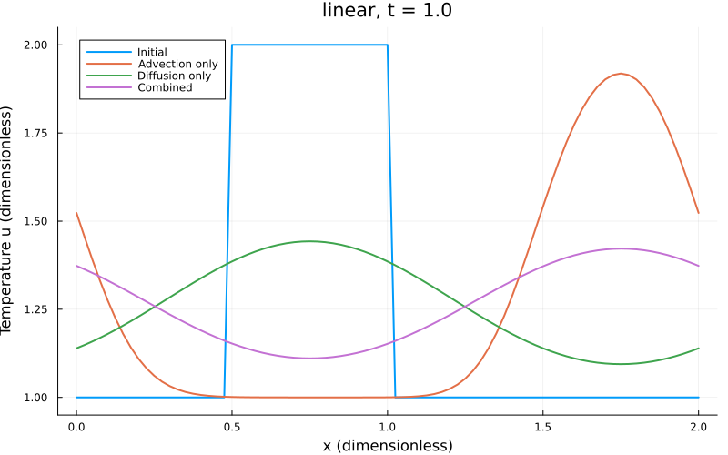
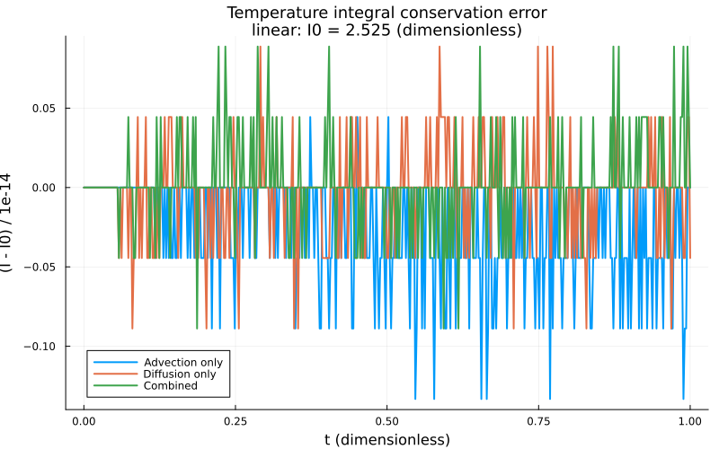
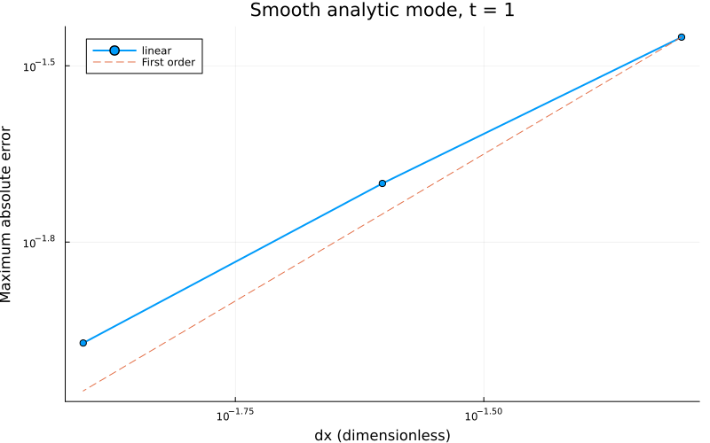
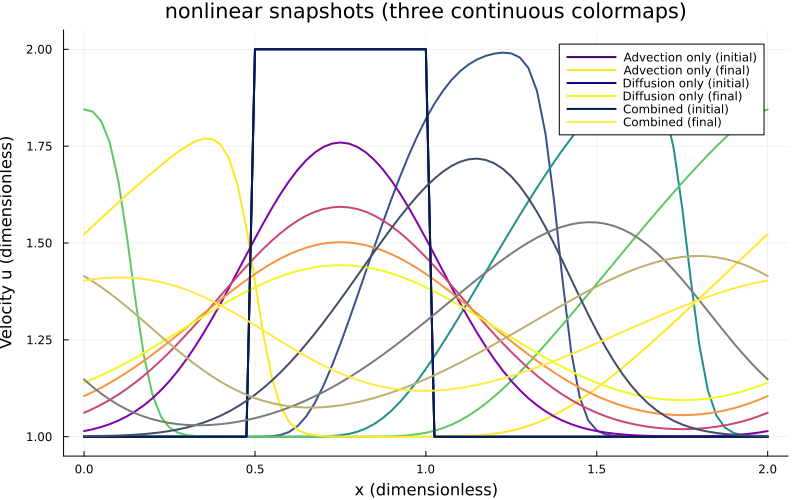
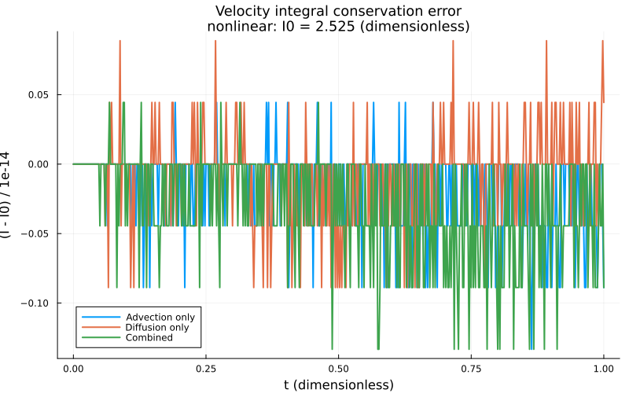
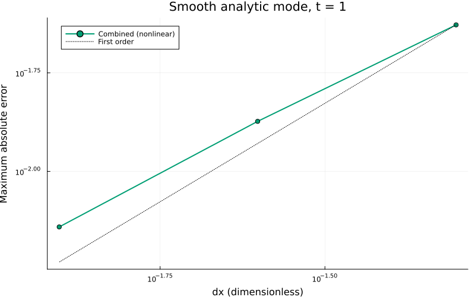

::: {.course-position}
第7回・課題 · 課題ID: N04
:::

## 定式化と実装条件 {#formulation}

### 選択して取り組む課題 {#選択して取り組む課題}

[下の問題設定・標準条件](#problem-setup)について，線形または非線形を選択します．

取り組む方程式は，一次元の移流拡散方程式です．

$$
\begin{gathered}
\frac{\partial u}{\partial t}+\frac{\partial f(u)}{\partial x}
=D\frac{\partial^2 u}{\partial x^2},\\
f(u)=\begin{cases}
cu & (\text{線形}),\\
u^2/2 & (\text{非線形}).
\end{cases}
\end{gathered}
$$

**選択したモデルだけで必修を完了できます．**
どちらも周期境界，3条件比較，保存，解析解による精度・格子収束が必修です．
N03完了後に，[課題の開始](../guides/workflow.qmd#start-exercise)で課題ID`N04`を指定します．

### 問題設定と標準条件 {#problem-setup}

$x,t$は無次元，$u$は線形モデルでは無次元温度，非線形モデルでは無次元速度です．
線形速度$c=1$，拡散係数$D=0.1$，領域は$[0,L)$，$L=2$，境界は$u(x+L,t)=u(x,t)$とします．
格子は$n_x=80$点，$\Delta x=L/n_x$，$x_i=(i-1)\Delta x$です．
最終時刻は$t_f=1$，初期条件`initial=:pulse`は次のとおりです．

$$
u(x,0)=\begin{cases}2&0.5\le x\le1,\\1&\text{それ以外}.\end{cases}
$$

#### 離散化と時間刻み {#discretization}

$i_-$は周期左隣（先頭では$n_x$），$i_+$は周期右隣（末尾では1）です．
全点を同じ旧配列から保存形上流差分＋中心差分＋前進Eulerで更新します．

$$
\begin{aligned}
u_i^{n+1}=u_i^n
&-\frac{\Delta t}{\Delta x}\bigl(f(u_i^n)-f(u_{i_-}^n)\bigr)\\
&+\frac{D\Delta t}{\Delta x^2}(u_{i_+}^n-2u_i^n+u_{i_-}^n).
\end{aligned}
$$

移流のみは$D=0$，拡散のみは流束差の項を0にします．
速度上限$a$は線形で$c$，非線形で初期場の$\max|u|$，拡散のみで0です．
$C=a\Delta t/\Delta x$，$r=D\Delta t/\Delta x^2$の合成条件$C+2r\le1$から刻みを求めます．

$$
\begin{gathered}
\lambda=a/\Delta x+2D/\Delta x^2,\\
\Delta t_{\max}=s/\lambda,\qquad s=0.8,\\
N_t=\max\left(1,\left\lceil\frac{t_f}{\Delta t_{\max}}\right\rceil\right),\\
\Delta t=\frac{t_f}{N_t}.
\end{gathered}
$$

公式の3条件比較は，移流拡散の刻みを移流のみ・拡散のみにも使います．
周期積分$I_h=\Delta x\sum_i u_i$を各時刻で記録し，初期値との差を確認します．

#### 解析解と格子収束

$k=2\pi/L$として，`initial=:mode`は選択モデルの次の解析解の$t=0$です．

$$
\begin{aligned}
u_{*,\mathrm{linear}}&=1\\
&\quad+\tfrac12e^{-Dk^2t}\sin\bigl(k(x-ct)\bigr).
\end{aligned}
$$

$$
\begin{gathered}
A(t)=\tfrac12e^{-Dk^2t},\qquad\theta=k(x-t),\\
u_{*,\mathrm{nonlinear}}(x,t)=1+\frac{2DkA(t)\sin\theta}{1+A(t)\cos\theta}.
\end{gathered}
$$

40・80・160点，$D=0.1$，$s=0.8$，$t_f=1$で移流拡散を計算します．
最大絶対誤差$E=\max_i|u_i-u_*(x_i,1)|$と，両区間の$p=\log_2(E_{\mathrm{coarse}}/E_{\mathrm{fine}})$を用います．

標準条件の観測次数の受入範囲は$0.8<p<1.2$です．

`advection=false`で拡散のみ，`diffusivity=0`で移流のみを計算できるようにします．

## 編集対象と選択

| 役割 | 学生リポジトリ内の場所 |
|---|---|
| モデル選択・実装・実行 | [`exercises/N04_advection_diffusion/run.jl`](https://github.com/t2lab-it/thermofluid-exercise-student-2026/blob/main/exercises/N04_advection_diffusion/run.jl) |
| 配布済み必須4群・自作2件 | [`exercises/N04_advection_diffusion/tests.jl`](https://github.com/t2lab-it/thermofluid-exercise-student-2026/blob/main/exercises/N04_advection_diffusion/tests.jl) |
| 選択理由と検証の記録 | `exercises/N04_advection_diffusion/learning_log.md` |
: {tbl-colwidths="[30, 70]"}

[`run.jl`](https://github.com/t2lab-it/thermofluid-exercise-student-2026/blob/main/exercises/N04_advection_diffusion/run.jl)の[`SELECTED_MODEL`](https://github.com/t2lab-it/thermofluid-exercise-student-2026/blob/main/exercises/N04_advection_diffusion/run.jl#L4)を`:unselected`から`:linear`または`:nonlinear`へ変更してください．
選択した流束と共通の刻み・更新の3箇所を完成させます．

| 学生API | 実装・契約 |
|---|---|
| [`advective_flux(u; model=SELECTED_MODEL, speed=1.0)`](https://github.com/t2lab-it/thermofluid-exercise-student-2026/blob/main/exercises/N04_advection_diffusion/run.jl#L10-L20) | 選択したモデルの流束を返す |
| [`stable_timestep(max_speed, dx, diffusivity; safety=0.8)`](https://github.com/t2lab-it/thermofluid-exercise-student-2026/blob/main/exercises/N04_advection_diffusion/run.jl#L23-L27) | 合成安定条件から正の有限な刻みを返す |
| [`advection_diffusion_step!(u_new, u_old, dt, dx, diffusivity; model=SELECTED_MODEL, advection=true, speed=1.0)`](https://github.com/t2lab-it/thermofluid-exercise-student-2026/blob/main/exercises/N04_advection_diffusion/run.jl#L30-L38) | 周期全点を同じ旧配列から更新し，新配列を返す |
: {tbl-colwidths="[34, 66]"}

[冒頭の更新式と条件切替](#discretization)に従って実装します．

[`provided_support.jl`](https://github.com/t2lab-it/thermofluid-exercise-student-2026/blob/main/exercises/N04_advection_diffusion/provided_support.jl)は入力検証，[`initial_condition`](https://github.com/t2lab-it/thermofluid-exercise-student-2026/blob/main/exercises/N04_advection_diffusion/provided_support.jl#L67-L73)，[`analytic_solution`](https://github.com/t2lab-it/thermofluid-exercise-student-2026/blob/main/exercises/N04_advection_diffusion/provided_support.jl#L75-L87)，[`conserved_integral`](https://github.com/t2lab-it/thermofluid-exercise-student-2026/blob/main/exercises/N04_advection_diffusion/provided_support.jl#L89-L96)，診断・描画・保存を提供します．
[`simulate`](https://github.com/t2lab-it/thermofluid-exercise-student-2026/blob/main/exercises/N04_advection_diffusion/run.jl#L43-L91)は時間積分を，[`main`](https://github.com/t2lab-it/thermofluid-exercise-student-2026/blob/main/exercises/N04_advection_diffusion/run.jl#L94-L103)は選択モデルの3条件と格子収束の計算・出力を行います．
これらを読み，式・旧配列・診断値・バッファ交換の対応を説明してください．

## 必須4群と自作2件

[共通のテスト手順](../guides/workflow.qmd#tests)で，課題単独と通過済みの課題を含むテストを実行します．
配布済み必須テストは次の4群です．

1. 非対称小配列の1ステップ，周期端，旧配列不変．
2. 定数場と周期積分の定義．
3. 移流または拡散を0にした極限．
4. 合成刻み，最終時刻，標準計算の有限性と安定性．

さらに次の2件を自作してください．

- **複数ステップ保存**：非対称な非定数・非負配列を使い，初期積分を独立に計算します．
  点数・値の大きさ・反復回数と丸め誤差を考えて許容誤差を決めます．
- **解析解と格子収束**：[冒頭の条件](#formulation)に従い，選択モデルの解析解との最大絶対誤差の減少と観測次数を確認します．

各テストの期待値と許容誤差の根拠，検出できる誤りと限界を学習ログへ記録してください．

## 公式出力と比較 {#reference-results}

[共通の実行手順](../guides/workflow.qmd#exercise-work)で，選択モデルの公式4出力を生成します．

~~~text
exercises/N04_advection_diffusion/results/<model>/comparison.png
exercises/N04_advection_diffusion/results/<model>/conservation.png
exercises/N04_advection_diffusion/results/<model>/convergence.png
exercises/N04_advection_diffusion/results/<model>/summary.toml
~~~

`<model>`は`linear`または`nonlinear`です．
保存図は初期積分からの変化を $10^{-14}$ 単位で示します．
`comparison.png`には灰色破線の初期分布と，最終時刻の3条件の分布だけを重ねます．
移流のみは青，拡散のみは朱色，移流拡散は緑の実線で示します．
線形・非線形で条件色を統一し，`conservation.png`でも同じ色を使います．
`convergence.png`の移流拡散の誤差は緑，1次比較線は黒点線です．

::: {.panel-tabset}
## 線形の基準

{fig-alt="灰色破線の初期分布と，時刻1の線形移流のみの青実線，拡散のみの朱色実線，移流拡散の緑実線の比較"}

{fig-alt="移流のみは青，拡散のみは朱色，移流拡散は緑で，全時刻の温度積分の保存誤差を10のマイナス14乗単位で示す"}

{fig-alt="40・80・160点の最大絶対誤差の減少と1次の比較線"}

[線形のsummary.toml](../assets/n04-reference/linear/summary.toml)と照合します．

## 非線形の基準

{fig-alt="灰色破線の初期分布と，時刻1の非線形移流のみの青実線，拡散のみの朱色実線，移流拡散の緑実線の比較"}

{fig-alt="移流のみは青，拡散のみは朱色，移流拡散は緑で，全時刻の速度積分の保存誤差を10のマイナス14乗単位で示す"}

{fig-alt="正の周期解析解に対する40・80・160点の誤差と1次の比較線"}

[非線形のsummary.toml](../assets/n04-reference/nonlinear/summary.toml)と照合します．
:::

`summary.toml`で，選択モデル・条件，CFL・Fo，周期積分の変化，最大・最小値，解析誤差・観測次数を図と照合してください．
生成ファイルは[公式出力の確認](../guides/workflow.qmd#official-results)に従って確認します．



## 完了条件

- 選択理由と式を記録し，選択流束・合成刻み・周期更新，旧配列の扱いを説明した．
- 選択モデルの必須4群・自作2件・過去課題の回帰テストが通り，許容誤差と検出限界を説明した．
- 初期分布と最終時刻の3条件を条件ごとの色で比較し，周期保存，合成安定条件，解析解に対する誤差・格子収束を図と数値で説明した．
- 公式4出力と学習ログを確認し，AI提案の採否理由と確認方法を記録した．
- [理解度チェック](#understanding-check)の対話全文をLETUSへ提出し，ログへ提出状況を記録した．
- 主要チェックポイントである一次元総合確認で式・コード・テスト・結果の対応を教員・TAへ説明し，PRのmerge前に確認を受けた．
- [学習ログ・diff・commit](../guides/workflow.qmd#commit)から[merge後](../guides/workflow.qmd#after-merge)まで完了した．

他方のモデルや固定・流出境界は[発展](../lessons/N04.qmd#発展)です．
