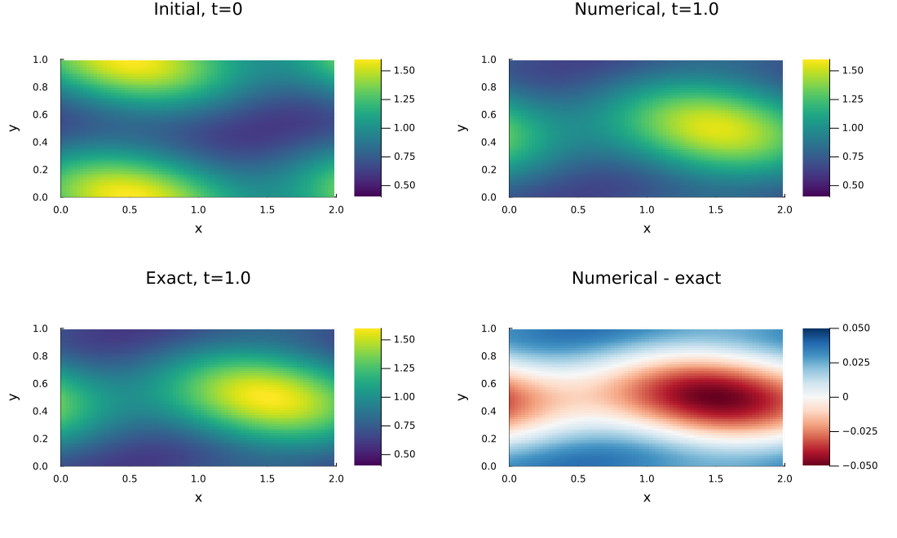
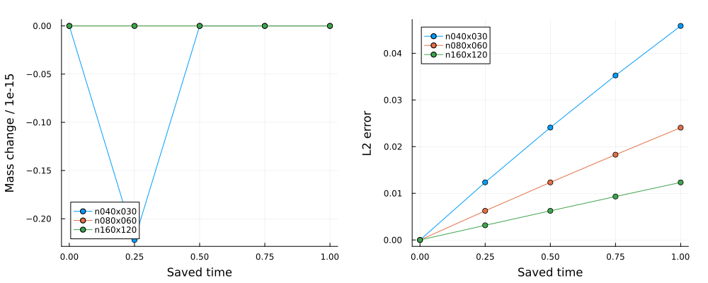
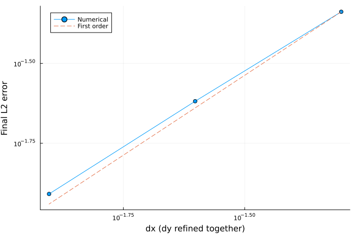

::: {.course-position}
第8回・課題 · 課題ID: N06
:::

## 必修の範囲

提出単位: `N05-N06`．
[N05課題](N05.qmd)と同じbranch・PR・学習ログを使います．
[N06授業の公式条件](../lessons/N06.qmd#problem-setup)で，定速度の二次元線形移流・両方向周期境界を実装します．
**保存量・解析解誤差・3格子の収束，空間分散の再解析と表示設定の再作図までが必修です．**
授業内は非正方の小配列で1ステップを実行し，授業後に公式3格子と考察まで完成させます．

## 編集対象

コードへのリンクは，対応する学生スターターのcommit `92a01c5`の該当箇所を指します．

| 役割 | 学生リポジトリ内の場所 |
|---|---|
| 合成刻み・二次元更新の2箇所 | [`src/N06Advection.jl`](https://github.com/t2lab-it/thermofluid-exercise-student-2026/blob/92a01c541f9c7579a77a65429d4662dfa7c84d17/src/N06Advection.jl) |
| 空間分散の実装 | [`exercises/N05-N06_common_package_2d_advection/analyze.jl`](https://github.com/t2lab-it/thermofluid-exercise-student-2026/blob/92a01c541f9c7579a77a65429d4662dfa7c84d17/exercises/N05-N06_common_package_2d_advection/analyze.jl) |
| 表示設定の変更 | [`exercises/N05-N06_common_package_2d_advection/plot.jl`](https://github.com/t2lab-it/thermofluid-exercise-student-2026/blob/92a01c541f9c7579a77a65429d4662dfa7c84d17/exercises/N05-N06_common_package_2d_advection/plot.jl) |
| 必須テストと自作2件 | [`exercises/N05-N06_common_package_2d_advection/tests.jl`](https://github.com/t2lab-it/thermofluid-exercise-student-2026/blob/92a01c541f9c7579a77a65429d4662dfa7c84d17/exercises/N05-N06_common_package_2d_advection/tests.jl) |
| 共通の記録 | [`exercises/N05-N06_common_package_2d_advection/learning_log.md`](https://github.com/t2lab-it/thermofluid-exercise-student-2026/blob/92a01c541f9c7579a77a65429d4662dfa7c84d17/exercises/N05-N06_common_package_2d_advection/learning_log.md) |
| 計算の提供入口 | [`exercises/N05-N06_common_package_2d_advection/simulate.jl`](https://github.com/t2lab-it/thermofluid-exercise-student-2026/blob/92a01c541f9c7579a77a65429d4662dfa7c84d17/exercises/N05-N06_common_package_2d_advection/simulate.jl) |
: {tbl-colwidths="[30, 70]"}

[`ThermofluidExercise.N06.stable_timestep(cx,cy,dx,dy; safety=0.8)`](https://github.com/t2lab-it/thermofluid-exercise-student-2026/blob/92a01c541f9c7579a77a65429d4662dfa7c84d17/src/N06Advection.jl#L11-L20)は合成CFLから有限な正の`Float64`を返します．
速度は非負で少なくとも一方が正，格子幅は正，`0 < safety <= 1`とします．
[`advection_step!(u_new,u_old,dt,dx,dy; cx=1.0,cy=0.5)`](https://github.com/t2lab-it/thermofluid-exercise-student-2026/blob/92a01c541f9c7579a77a65429d4662dfa7c84d17/src/N06Advection.jl#L21-L32)は周期全点を同じ旧配列から更新し，新配列を返します．
旧・新配列は独立した記憶領域を使い，合成CFLを検証してから新配列へ結果を書き込みます．
片方向速度0を扱い，両速度0の1ステップは旧値をコピーします．

[`spatial_variance(u)`](https://github.com/t2lab-it/thermofluid-exercise-student-2026/blob/92a01c541f9c7579a77a65429d4662dfa7c84d17/exercises/N05-N06_common_package_2d_advection/analyze.jl#L3-L7)は各保存時刻の空間分散を，有限な非負の`Float64`で返します．
分散を実装して再解析し，`diagnostics_complete=true`を確認してください．
`plot.jl`の[`COLORMAP`](https://github.com/t2lab-it/thermofluid-exercise-student-2026/blob/92a01c541f9c7579a77a65429d4662dfa7c84d17/exercises/N05-N06_common_package_2d_advection/plot.jl#L5)，[`COLOR_LIMITS`](https://github.com/t2lab-it/thermofluid-exercise-student-2026/blob/92a01c541f9c7579a77a65429d4662dfa7c84d17/exercises/N05-N06_common_package_2d_advection/plot.jl#L6)，[`DISPLAY_CASE`](https://github.com/t2lab-it/thermofluid-exercise-student-2026/blob/92a01c541f9c7579a77a65429d4662dfa7c84d17/exercises/N05-N06_common_package_2d_advection/plot.jl#L7)から表示条件を変更します．
計算条件を変えず，初期場・数値解・解析解の色の上下限を共通に保って比較します．

時間積分・解析解・HDF5入出力・基本診断・収束反復・描画は提供コードです．
[`provided_support.jl`](https://github.com/t2lab-it/thermofluid-exercise-student-2026/blob/92a01c541f9c7579a77a65429d4662dfa7c84d17/exercises/N05-N06_common_package_2d_advection/provided_support.jl)と各入口を読み，入力と出力の対応を説明してください．

## 実行と自作テスト

[段階別の実行手順](../guides/workflow.qmd#n05-n06-stages)で，計算，基本解析，分散追加後の再解析，再作図の順に実行します．
再解析・再作図の前後で`fields.h5`のSHA-256が同じであることを記録します．
一括入口[`exercises/N05-N06_common_package_2d_advection/run.jl`](https://github.com/t2lab-it/thermofluid-exercise-student-2026/blob/92a01c541f9c7579a77a65429d4662dfa7c84d17/exercises/N05-N06_common_package_2d_advection/run.jl)はN05回帰確認とN06の全段階を実行します．

[課題単独と進捗連動のテスト](../guides/workflow.qmd#tests)を実行します．
配布済みテストは非対称な1ステップ，周期端・角，旧配列不変・非alias，定数場，片方向速度0，合成CFL，保存時刻と出力の整合を確認します．
自作するテストは次の2件です．

- 非対称な非定数場を複数ステップ更新し，独立に計算した初期積分の保存を検証する．
- 公式3格子で最終時刻の解析解に対するL2誤差が減少し，二つの区間の観測次数が`0.8 <= p <= 1.2`となることを検証する．

保存量の許容誤差は初期積分の相対スケール付き`1e-12`を目安とし，値の大きさ・点数・反復回数を踏まえて説明します．
期待値・許容誤差の根拠と，検出できる誤り・検出できない誤りをログへ残します．
過去課題のテストも継続し，N05-N06のテストは一つの提出単位として1回実行されます．

## 公式出力と比較 {#reference-results}

N05の2ファイルに加え，`results/N06/`へ次の6ファイルを保存します．

| 出力 | 確認する内容 |
|---|---|
| `fields.h5` | 3格子の座標・5保存時刻・場・条件・実効刻み・単位・軸順序 |
| `summary.toml` | 入力ハッシュ，完了フラグ，保存量・平均・極値・分散・誤差・観測次数 |
| `fields.png` | 代表格子の初期場・最終数値解・解析解・誤差 |
| `diagnostics.png` | 保存時刻ごとの積分変化（`1e-15`単位）と誤差 |
| `convergence.png` | 3格子のL2誤差と1次比較線 |
| `plots.toml` | HDF5とsummaryのハッシュ，表示格子・時刻・カラーマップ・色の上下限 |

{fig-alt="80掛ける60格子の初期場，時刻1の数値解と解析解，共通の色範囲での比較，および数値解から解析解を引いた誤差"}

{fig-alt="保存した5時刻での3格子の積分変化を10のマイナス15乗単位で表示し，L2誤差の推移と並べた図"}

{fig-alt="3格子の最終L2誤差が格子幅とともに減少し，1次比較線に近づく両対数図"}

基準計算の[summary.toml](../assets/n06-reference/summary.toml)と[plots.toml](../assets/n06-reference/plots.toml)を図と照合できます．
HDF5は自分の計算で生成してください．
[公式出力の確認](../guides/workflow.qmd#official-results)で1ファイル5 MiB，1内容ID10 MiB，全課題100 MiBの上限も確認します．



## 完了条件

- 二方向の式・配列軸・周期端と角・合成CFL・バッファ交換を図とコードで説明した．
- 必須テスト・自作2件・過去課題のテストが通り，保存と解析解誤差，3格子の約1次収束を示した．
- 同じ保存場から空間分散を追加し，表示条件を変えて再作図し，入力ハッシュの不変と保存時刻の限界を説明した．
- N05の回帰証拠とN06の6出力，AI提案の採否理由・検証・考察を一つの学習ログへ記録した．
- N05・N06それぞれの[理解度チェック](#understanding-check)の対話全文をLETUSへ提出し，ログへ提出状況を記録した．
- [学習ログ・diff・commit](../guides/workflow.qmd#commit)から[merge後](../guides/workflow.qmd#after-merge)まで，提出単位`N05-N06`の一つのPRで完了した．
