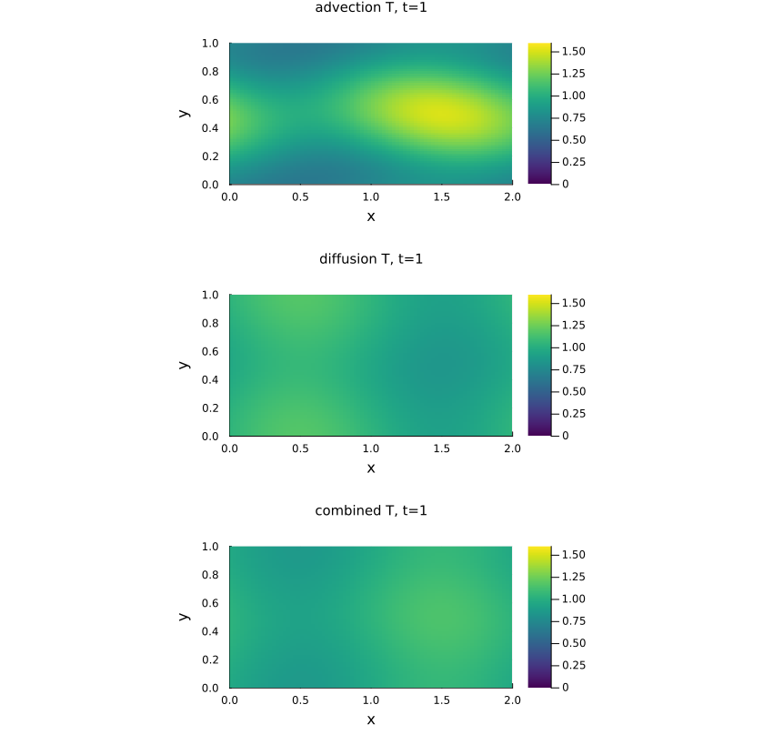
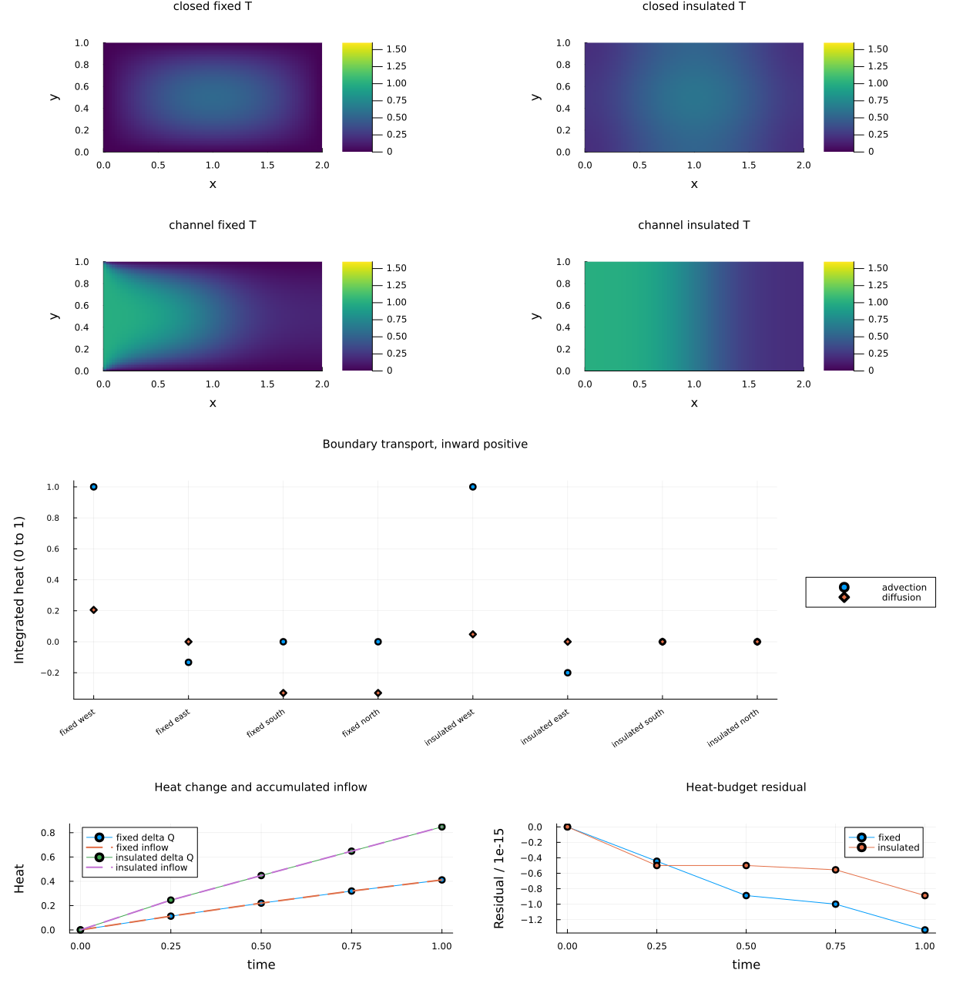
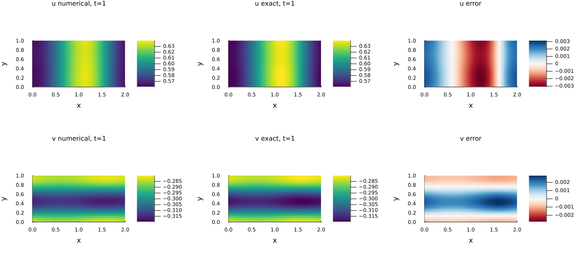
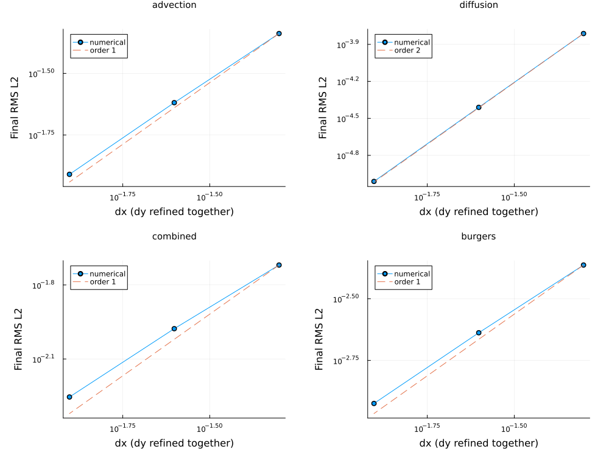

::: {.course-position}
第9回・課題 · 課題ID: N07
:::

## 必修の範囲

提出単位は`N07`で，1 branch・1 PR・1学習ログを使います．
`N05-N06`を完了し，[N07授業](../lessons/N07.qmd)の温度境界条件・熱収支・二成分Burgersを実装します．
**固定温度・断熱，移流・拡散・移流拡散，開いた系の移流と拡散を合わせた熱収支，二成分Burgersをすべて必修**とします．
授業内の最低到達点は，開境界1ステップの流入・流出・壁熱流束を説明して熱収支を照合し，小配列でBurgersの二成分同時更新と風上方向を確認することです．
全実験・収束・作図・自作テスト・考察は授業後までに完成させます．

## 編集対象と提供コード

| 役割 | 学生リポジトリ内の編集先 |
|---|---|
| 温度の安定刻み・面流束・更新，Burgersの刻み・更新 | [`src/N07Transport.jl`](https://github.com/t2lab-it/thermofluid-exercise-student-2026/blob/efbb5db232aaaf7b7de41eee1f7a38c0edba8831/src/N07Transport.jl) |
| 保存区間の熱収支解析 | [`exercises/N07_2d_advection_diffusion/analyze.jl`](https://github.com/t2lab-it/thermofluid-exercise-student-2026/blob/efbb5db232aaaf7b7de41eee1f7a38c0edba8831/exercises/N07_2d_advection_diffusion/analyze.jl) |
| 配布済み必須テストと自作2群 | [`exercises/N07_2d_advection_diffusion/tests.jl`](https://github.com/t2lab-it/thermofluid-exercise-student-2026/blob/efbb5db232aaaf7b7de41eee1f7a38c0edba8831/exercises/N07_2d_advection_diffusion/tests.jl) |
| 予想・証拠・判断の記録 | [`exercises/N07_2d_advection_diffusion/learning_log.md`](https://github.com/t2lab-it/thermofluid-exercise-student-2026/blob/efbb5db232aaaf7b7de41eee1f7a38c0edba8831/exercises/N07_2d_advection_diffusion/learning_log.md) |
| 表示条件 | [`exercises/N07_2d_advection_diffusion/plot.jl`](https://github.com/t2lab-it/thermofluid-exercise-student-2026/blob/efbb5db232aaaf7b7de41eee1f7a38c0edba8831/exercises/N07_2d_advection_diffusion/plot.jl) |

N05の周期添字と共通検証を再利用し，N06の完成ソルバは維持します．
時間積分，保存時刻への短縮，HDF5入出力，解析解，基本診断と描画は提供します．
`exercises/N07_2d_advection_diffusion/`の`simulate.jl`が計算，`analyze.jl`が解析，`plot.jl`が作図を担当します．
一括実行には`exercises/N07_2d_advection_diffusion/run.jl`を使います．
提供する`provided_support.jl`も読み，場と境界輸送の流れを説明してください．

## 固定API {#api}

`ThermofluidExercise.N07`内に次の関数を実装します．

```julia
thermal_stable_timestep(cx, cy, kappa, dx, dy, bc; safety=0.8)
thermal_fluxes!(fluxes, T, dx, dy; cx, cy, kappa, bc)
thermal_step!(Tnew, Told, dt, dx, dy; cx, cy, kappa, bc)
burgers_stable_timestep(u, v, nu, dx, dy; safety=0.8)
burgers_step!(unew, vnew, uold, vold, dt, dx, dy; nu)
```

刻み関数は有限正の`Float64`を返します．
`bc=(;west,east,south,north)`の各辺は`(;kind::Symbol,value::Float64)`で，値不要の境界は`value=0.0`です．
`periodic`，`dirichlet`，`insulated`，左`inflow`，右`outflow`の組合せ検証は提供されます．
流束は`(;adv_x,diff_x,adv_y,diff_y)`で，x面は`(nx+1,ny)`，y面は`(nx,ny+1)`です．
正x・正y方向の移流／拡散流束を全要素に書き，`fluxes`を返します．
`thermal_step!`は同じ旧場から面流束を一度だけ構築し，`(;temperature=Tnew,boundary_rates)`を返します．
`boundary_rates`の`advective`と`diffusive`はそれぞれ`(;west,east,south,north)`で，辺長で積分した**内向き正**のレートです．
Burgersは同じ二つの旧場から両成分を更新し，`(;u=unew,v=vnew)`を返します．

入力は1始まりの浮動小数行列，各軸3以上，有限な旧値，同形状で，新旧バッファは非aliasです．
係数は有限，`kappa,nu>=0`，格子幅は正，`0<safety<=1`です．
形状・alias・係数・安定条件の検証は提供コードで行います．

`analyze.jl`では次を実装します．

```julia
heat_budget(time, heat, advective_integrals, diffusive_integrals)
```

時刻は0始まりの有限・狭義増加列で2点以上，`heat`は同じ長さの有限列です．
積分入力は`(4,nt-1)`の有限配列，辺順はwest，east，south，northです．
戻り値は`(;net_input,cumulative_input,residual)`で，長さは順に`nt-1,nt,nt`です．
後二つの先頭は0，`residual[k]=heat[k]-heat[1]-cumulative_input[k]`とします．

## 実験・検証・記録

[段階別の実行](../guides/workflow.qmd#n07-stages)で計算・解析・作図を独立に実行します．
再解析・再作図の前後で両HDF5のSHA-256を比較します．
[公式条件](../lessons/N07.qmd#thermal-cases)の温度7ケースと共通刻みの代表比較3ケース，周期Burgersを生成します．

配布済み必須テストを保持し，自作テストは次の2群を完成させます．

1. 開境界の上下固定温度／断熱の2条件を複数ステップ進め，辺別・移流／拡散別の積算と総熱量変化を照合する．
2. 周期温度の拡散・合成と二成分Burgersについて，解析解誤差と3格子の両区間の観測次数を検証する．

非対称な小配列と`dx!=dy`を使い，入力・期待値・許容値の根拠を自分で書きます．
熱収支の初期許容値は`1e-12*max(1,abs(Q0),sum(abs,境界輸送積分))`です．
誤差が単調減少し，拡散は`1.8<=p<=2.2`，移流・合成・Burgersは`0.8<=p<=1.2`を確認します．
固定温度閉系も解析解と比較します．
[課題単独と進捗連動のテスト](../guides/workflow.qmd#tests)の両方を実行します．

## 公式8出力 {#reference-results}

`exercises/N07_2d_advection_diffusion/results/`へ保存します．

| 出力 | 確認内容 |
|---|---|
| `temperature.h5` | 温度・座標・境界・係数・全step時刻とdt・保存step対応・辺別区間熱輸送 |
| `burgers.h5` | 二成分速度・座標・係数・全step時刻とdt・保存step対応 |
| `summary.toml` | 両入力のhashとrun_id，条件，熱量・極値・誤差・熱収支・収束次数 |
| `temperature_comparison.png` | 共通刻み・共通色範囲での周期温度3条件 |
| `boundary_heat.png` | 固定温度／断熱，辺別・機構別輸送，累積流入と熱量変化，残差 |
| `burgers_fields.png` | u/vの数値解・解析解・対称色範囲の誤差 |
| `convergence.png` | 温度3条件とBurgersの誤差・収束の傾き |
| `plots.toml` | HDF5・summary・図のhash，表示ケース・格子・時刻・色範囲 |

[容量検査](../guides/workflow.qmd#official-results)で，追加ファイルも含めて1ファイル5 MiB，N07全体10 MiB，全課題100 MiBに収まることを確認します．

{fig-alt="共通刻みで計算した温度の移流・拡散・移流拡散を共通の色範囲で示す図"}

{fig-alt="固定温度と断熱の温度場，辺別の移流と拡散の熱輸送，熱量変化・累積流入・残差"}

{fig-alt="uとvそれぞれの数値解・解析解・誤差を区別した6パネル"}

{fig-alt="温度3条件とBurgersについて3格子誤差と1次または2次の比較線を示す図"}

基準の[summary.toml](../assets/n07-reference/summary.toml)・[plots.toml](../assets/n07-reference/plots.toml)を照合できます．

図の細部は[温度比較](../assets/n07-reference/temperature_comparison.png)，[境界熱収支](../assets/n07-reference/boundary_heat.png)，[Burgers](../assets/n07-reference/burgers_fields.png)，[収束](../assets/n07-reference/convergence.png)を単独表示して確認できます．



## 完了条件

- 全必修実験と公式8出力が揃い，熱収支・解析解誤差・収束・来歴・容量の検査が通る．
- 必須テストと自作2群，過去課題を含むテストが成功する．
- 半セル距離，流束符号，断熱と流出の違い，二成分結合と動的刻みを式・コード・結果で説明できる．
- 予想・自作テストの根拠・AI提案の採否と検証証拠を学習ログへ記し，理解度チェック全文をLETUSへ提出する．
