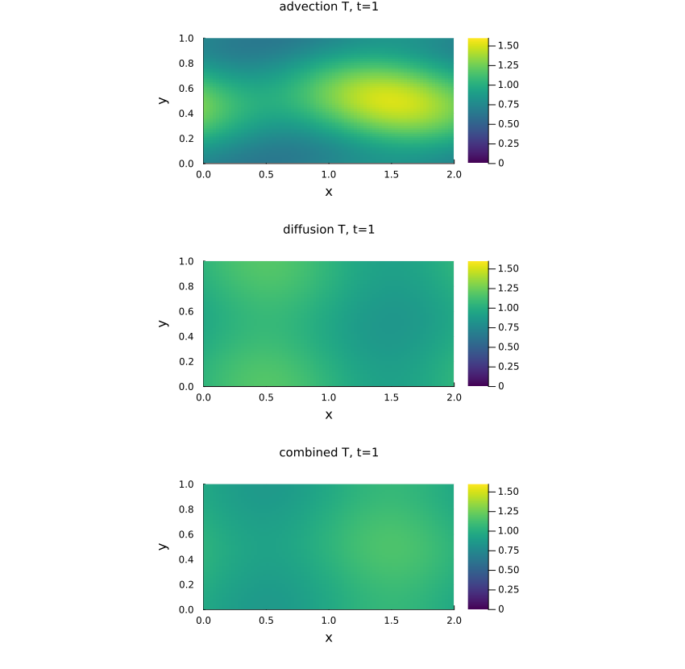
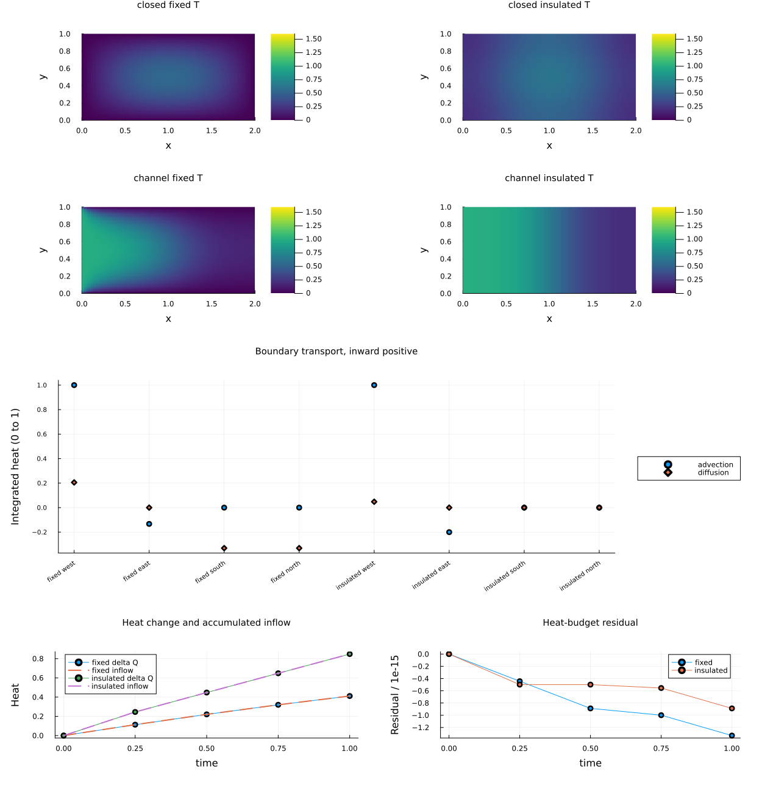
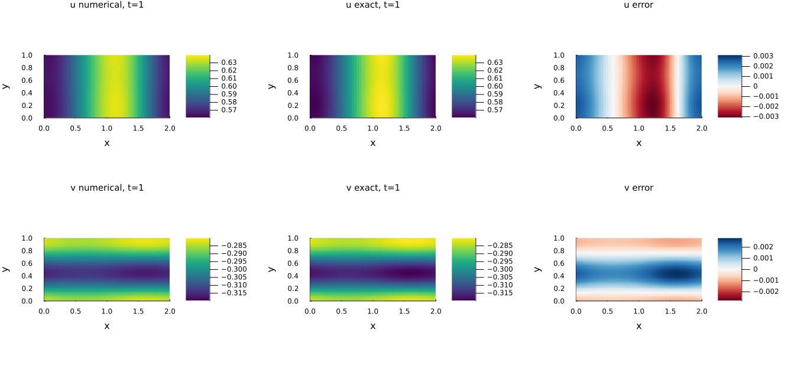
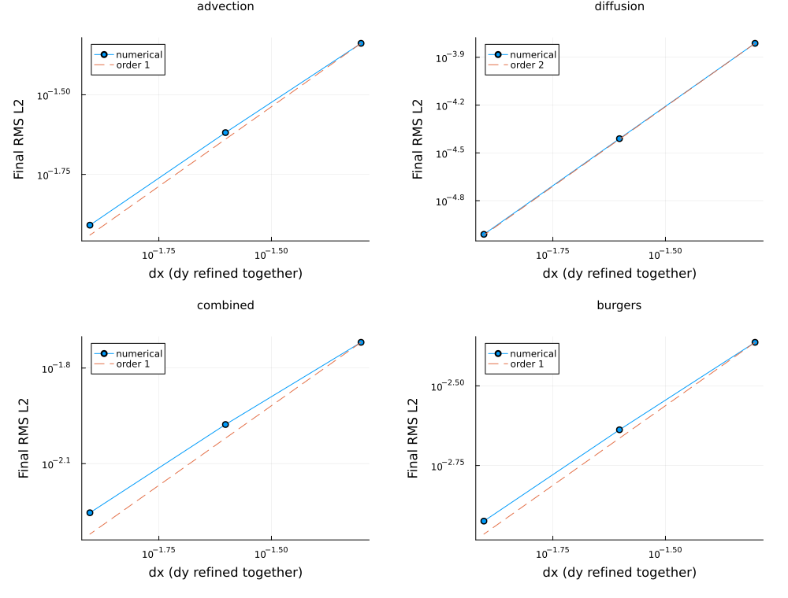

::: {.course-position}
第9回・課題 · 課題ID: N07
:::



## 定式化と実装条件 {#formulation}

### 必修の範囲 {#必修の範囲}

提出単位は`N07`で，1 branch・1 PR・1学習ログを使います．
`N05-N06`を完了し，[N07授業](../lessons/N07.qmd)の温度境界条件・熱収支・二成分Burgersを実装します．

移流のみでは$\kappa=0$，拡散のみでは$\boldsymbol c=\boldsymbol 0$とします．
温度輸送では，次の移流拡散方程式
$$
\begin{aligned}
\frac{\partial T}{\partial t}+\nabla\cdot\boldsymbol J&=0,\\
\boldsymbol J&=\boldsymbol cT-\kappa\nabla T
\end{aligned}
$$
に取り組みます．

二成分Burgersでは，次の二つの方程式
$$
\begin{aligned}
\frac{\partial u}{\partial t}+u \frac{\partial u}{\partial x}+v \frac{\partial u}{\partial y}&=\nu(\frac{\partial^2 u}{\partial x^2}+\frac{\partial^2 u}{\partial y^2}),\\
\frac{\partial v}{\partial t}+u \frac{\partial v}{\partial x}+v \frac{\partial v}{\partial y}&=\nu(\frac{\partial^2 v}{\partial x^2}+\frac{\partial^2 v}{\partial y^2})
\end{aligned}
$$
を同時に進めます．

**固定温度・断熱，移流・拡散・移流拡散，開いた系の移流と拡散を合わせた熱収支，二成分Burgersをすべて必修**とします．
授業内の最低到達点は，開境界1ステップの流入・流出・壁熱流束を説明して熱収支を照合し，小配列でBurgersの二成分同時更新と風上方向を確認することです．
全実験・収束・作図・自作テスト・考察は授業後までに完成させます．

### 領域・格子と公式実験 {#problem-setup}

$T$は体積熱容量を1とした無次元温度，$u,v$は無次元速度で，座標と時刻も無次元です．
領域は$[0,2]\times[0,1]$，セル中心格子を使います．
$\Delta x=2/n_x$，$\Delta y=1/n_y$，$x_i=(i-1/2)\Delta x$，$y_j=(j-1/2)\Delta y$で，場の配列軸は`[i,j]`すなわちx,y順です．
境界面と隣接セル中心の距離は半セルです．
最終時刻は1，保存時刻は$0,0.25,0.5,0.75,1$です．

温度の初期場を$F(x,y)$，$S(x,y)$として
$$
\begin{aligned}
F(x,y)&=1+0.2\sin(\pi x)\\
&\quad+0.3\cos(2\pi y)\\
&\quad+0.1\sin(\pi x+2\pi y),\\
S(x,y)&=\sin(\pi x/2)\sin(\pi y)
\end{aligned}
$$
と定義します．

::: {.table-responsive}
| ケース | $(c_x,c_y)$ | $\kappa$ | 境界条件 | 初期場 |
|---|---|---|---|---|
| `periodic_advection` | $(1,0.5)$ | 0 | 両方向周期 | $F$ |
| `periodic_diffusion` | $(0,0)$ | 0.05 | 両方向周期 | $F$ |
| `periodic_combined` | $(1,0.5)$ | 0.05 | 両方向周期 | $F$ |
| `closed_fixed` | $(0,0)$ | 0.05 | 全辺固定温度0 | $S$ |
| `closed_insulated` | $(0,0)$ | 0.05 | 全辺断熱 | $S$ |
| `channel_fixed` | $(1,0)$ | 0.05 | 左流入温度1，右流出，上下固定温度0 | 0.2 |
| `channel_insulated` | $(1,0)$ | 0.05 | 左流入温度1，右流出，上下断熱 | 0.2 |
:::

周期3ケースと`periodic_burgers`は$(40,30),(80,60),(160,120)$の3格子，閉鎖・流路の4ケースは$(80,60)$で計算します．
`comparison_advection`，`comparison_diffusion`，`comparison_combined`は対応する周期ケースの$(80,60)$計算で，3条件とも移流拡散の刻みに揃えます．

### 温度の流束・更新・境界条件 {#discretization}

y方向も同様に正y向きを正とします．
内部面の正x向き流束は，次式の移流と拡散の和
$$
\begin{aligned}
J^a_{i+1/2,j}&=c_xT_{\mathrm{upwind}},\\
T_{\mathrm{upwind}}&=\begin{cases}T_{ij}&c_x\ge0,\\T_{i+1,j}&c_x<0,\end{cases}\\
J^d_{i+1/2,j}&=-\kappa\frac{T_{i+1,j}-T_{ij}}{\Delta x}
\end{aligned}
$$
です．

`adv_x[i+1,j]`と`diff_x[i+1,j]`がこの内部面に対応し，添字1が西境界，$n_x+1$が東境界です．
y面も`[i,j+1]`が内部面で，添字1が南境界，$n_y+1$が北境界です．
全セルを同じ旧場から次式
$$
\begin{aligned}
T_{ij}^{n+1}&=T_{ij}^n\\
&\quad-\frac{\Delta t}{\Delta x}(J_{i+1/2,j}^n-J_{i-1/2,j}^n)\\
&\quad-\frac{\Delta t}{\Delta y}(J_{i,j+1/2}^n-J_{i,j-1/2}^n)
\end{aligned}
$$
で更新します．

境界の定式化では外向き単位法線方向を正とし，$T_c$を境界に隣接するセル値，$h$を法線方向の格子幅とします．
下表の外向き流束を，西・南では符号反転，東・北ではそのまま面配列へ書きます．

::: {.table-responsive}
| 境界の種類 | 外向き移流流束 | 外向き拡散流束 |
|---|---|---|
| 閉じた固定温度$T_b$ | 0 | $2\kappa(T_c-T_b)/h$ |
| 閉じた断熱$\frac{\partial T}{\partial n}=0$ | 0 | 0 |
| 西流入，$c_x>0$，温度$T_{\mathrm{in}}$ | $-c_xT_{\mathrm{in}}$ | $2\kappa(T_c-T_{\mathrm{in}})/\Delta x$ |
| 東流出，$\frac{\partial T}{\partial x}=0$ | $c_xT_c$ | 0 |
:::

周期面は対向する末尾・先頭セルを内部面と同じ式で結び，面配列の両端へ同じ正方向流束を書きます．
角セルもx面とy面の寄与を加えます．

#### 安定刻み

$a_x$は西・東のいずれかが固定温度または流入なら3，それ以外は2，$a_y$も南・北について同様です．
$s=0.8$として次式
$$
\begin{aligned}
\lambda_T&=|c_x|/\Delta x+|c_y|/\Delta y\\
&\quad+\kappa(a_x/\Delta x^2+a_y/\Delta y^2),\\
\Delta t_{\max}&=s/\lambda_T
\end{aligned}
$$
を使い，各ステップの刻みを次の保存時刻までの残り時間以下へ短縮します．

更新の安定条件は$\Delta t\lambda_T\le1$です．

#### 辺別熱輸送と熱収支 {#heat-budget}

熱量は$Q_h=\Delta x\Delta y\sum_{i,j}T_{ij}$です．
移流・拡散ごとに面流束から次の辺別レート
$$
\begin{aligned}
R_W&=\Delta y\sum_jJ_{1/2,j},\\
R_E&=-\Delta y\sum_jJ_{n_x+1/2,j},\\
R_S&=\Delta x\sum_iJ_{i,1/2},\\
R_N&=-\Delta x\sum_iJ_{i,n_y+1/2}
\end{aligned}
$$
を求め，**内向き正**で返します．

$b$が西・東・南・北の4辺を走るとすると，1ステップの熱量変化は
$$
Q_h^{n+1}-Q_h^n=\Delta t\sum_b(R_b^a+R_b^d)
$$
です．

保存区間ごとに，各実ステップの$\Delta tR_b$を足して辺別輸送積分を記録します．
`heat_budget`の`net_input`は各区間の移流・拡散・4辺の積分の総和，`cumulative_input`は先頭0からの累積和です．
`cumulative_input[m]`を$I_m$と書くと，収支残差は
$$
\varepsilon_Q(t_m)=Q_h(t_m)-Q_h(0)-I_m
$$
です．

許容値は`1e-12*max(1,abs(Q0),sum(abs,advective_integrals)+sum(abs,diffusive_integrals))`です．

### Burgersの初期境界条件・更新 {#burgers-formulation}

`periodic_burgers`は同じセル中心領域で両方向周期，$\nu=0.05$です．
初期場は次の解析解
$$
\begin{gathered}
X=x-0.6t,\quad Y=y+0.3t,\\
A=0.2e^{-\nu\pi^2t},\quad B=0.2e^{-4\nu\pi^2t},\\
\phi=1+A\cos(\pi X)+B\cos(2\pi Y),\\
u_*=0.6+\frac{2\nu A\pi\sin(\pi X)}{\phi},\\
v_*=-0.3+\frac{4\nu B\pi\sin(2\pi Y)}{\phi}
\end{gathered}
$$
を$t=0$で評価して作ります．

$w=u,v$について，移流速度は両成分とも旧場の$u,v$を使います．
風上微分$D_x^{\mathrm{up}}w$は$u_{ij}\ge0$で$(w_{ij}-w_{i_-,j})/\Delta x$，負で$(w_{i_+,j}-w_{ij})/\Delta x$です．
$D_y^{\mathrm{up}}w$も旧$v_{ij}$の符号で選び，添字は両方向とも周期です．
中心差分Laplacian$\Delta_hw$と前進Eulerにより，両成分を同じ旧場から次式
$$
\begin{aligned}
w_{ij}^{n+1}=w_{ij}^n
&-\Delta t\,u_{ij}^nD_x^{\mathrm{up}}w_{ij}^n\\
&-\Delta t\,v_{ij}^nD_y^{\mathrm{up}}w_{ij}^n\\
&+\nu\Delta t\,\Delta_hw_{ij}^n,\\
\Delta_hw_{ij}
&=\frac{w_{i_+,j}-2w_{ij}+w_{i_-,j}}{\Delta x^2}\\
&\quad+\frac{w_{i,j_+}-2w_{ij}+w_{i,j_-}}{\Delta y^2}
\end{aligned}
$$
で同時に更新します．

刻み上限は毎ステップの旧場から
$$
\begin{gathered}
a_B=\max_{i,j}(|u_{ij}|/\Delta x+|v_{ij}|/\Delta y),\\
\lambda_B=a_B+2\nu(1/\Delta x^2+1/\Delta y^2),\\
\Delta t_{\max}=0.8/\lambda_B
\end{gathered}
$$
で再計算し，保存時刻までの残り時間以下にします．

#### 温度の解析解と誤差指標

周期温度の解析解は$X=x-c_xt$，$Y=y-c_yt$として
$$
\begin{aligned}
T_*&=1+0.2e^{-\kappa\pi^2t}\sin(\pi X)\\
&\quad+0.3e^{-4\kappa\pi^2t}\cos(2\pi Y)\\
&\quad+0.1e^{-5\kappa\pi^2t}\sin(\pi X+2\pi Y).
\end{aligned}
$$

閉じた固定温度の解析解は$T_*=e^{-\kappa((\pi/2)^2+\pi^2)t}S(x,y)$です．
その他の閉鎖・流路ケースでは，指定初期値と辺別熱収支を検証します．
$M=n_xn_y$として，温度誤差は$E_T=\sqrt{\sum(T-T_*)^2/M}$，Burgers誤差は$E_B=\sqrt{\sum((u-u_*)^2+(v-v_*)^2)/M}$です．
最終時刻の3格子で$p=\log_2(E_{\mathrm{coarse}}/E_{\mathrm{fine}})$を求めます．

### 収束の判定条件 {#standard-conditions}

誤差が単調減少し，拡散は`1.8<=p<=2.2`，移流・合成・Burgersは`0.8<=p<=1.2`を確認します．

### 入力・戻り値の契約 {#input-contract}

刻み関数は正の`Float64`を返します．
`bc=(;west,east,south,north)`の各辺は`(;kind::Symbol,value::Float64)`で，`periodic`・`insulated`・`outflow`では`value=0.0`です．
`periodic`，`dirichlet`，`insulated`，左`inflow`，右`outflow`の組合せ検証は提供されます．
流束は`(;adv_x,diff_x,adv_y,diff_y)`で，x面は`(nx+1,ny)`，y面は`(nx,ny+1)`です．
正x・正y方向の移流／拡散流束を全要素に書き，`fluxes`を返します．
[`thermal_step!`](https://github.com/t2lab-it/thermofluid-exercise-student-2026/blob/main/src/N07Transport.jl#L87)は同じ旧場から面流束を一度だけ構築し，`(;temperature=Tnew,boundary_rates)`を返します．
`boundary_rates`の`advective`と`diffusive`はそれぞれ`(;west,east,south,north)`で，辺長で積分した**内向き正**のレートです．
Burgersは同じ二つの旧場から両成分を更新し，`(;u=unew,v=vnew)`を返します．

入力は1始まりで各軸3点以上の浮動小数行列とし，新旧バッファは同形状の独立した配列を使います．
`kappa,nu>=0`，格子幅は正，`0<safety<=1`とします．

時刻は0始まりの狭義増加列で，`heat`は同じ長さの列です．
積分入力は`(4,nt-1)`の配列，辺順はwest，east，south，northです．
戻り値は`(;net_input,cumulative_input,residual)`で，長さは順に`nt-1,nt,nt`です．
後二つの先頭は0で，`residual`は[上の熱収支残差](#heat-budget)です．

## 編集対象と提供コード

::: {.table-responsive}
| 役割 | 学生リポジトリ内の編集先 |
|---|---|
| 温度の安定刻み・面流束・更新，Burgersの刻み・更新 | [`src/N07Transport.jl`](https://github.com/t2lab-it/thermofluid-exercise-student-2026/blob/main/src/N07Transport.jl) |
| 保存区間の熱収支解析 | [`exercises/N07_2d_advection_diffusion/analyze.jl`](https://github.com/t2lab-it/thermofluid-exercise-student-2026/blob/main/exercises/N07_2d_advection_diffusion/analyze.jl) |
| 配布済み必須テストと自作2群 | [`exercises/N07_2d_advection_diffusion/tests.jl`](https://github.com/t2lab-it/thermofluid-exercise-student-2026/blob/main/exercises/N07_2d_advection_diffusion/tests.jl) |
| 予想・証拠・判断の記録 | [`exercises/N07_2d_advection_diffusion/learning_log.md`](https://github.com/t2lab-it/thermofluid-exercise-student-2026/blob/main/exercises/N07_2d_advection_diffusion/learning_log.md) |
| 表示条件 | [`exercises/N07_2d_advection_diffusion/plot.jl`](https://github.com/t2lab-it/thermofluid-exercise-student-2026/blob/main/exercises/N07_2d_advection_diffusion/plot.jl) |
:::

N05の周期添字と共通検証を再利用し，N06の完成ソルバは維持します．
時間積分，保存時刻への短縮，HDF5入出力，解析解，基本診断と描画は提供します．
[`exercises/N07_2d_advection_diffusion/`](https://github.com/t2lab-it/thermofluid-exercise-student-2026/tree/main/exercises/N07_2d_advection_diffusion)の[`simulate.jl`](https://github.com/t2lab-it/thermofluid-exercise-student-2026/blob/main/exercises/N07_2d_advection_diffusion/simulate.jl)が計算，[`analyze.jl`](https://github.com/t2lab-it/thermofluid-exercise-student-2026/blob/main/exercises/N07_2d_advection_diffusion/analyze.jl)が解析，[`plot.jl`](https://github.com/t2lab-it/thermofluid-exercise-student-2026/blob/main/exercises/N07_2d_advection_diffusion/plot.jl)が作図を担当します．
一括実行には[`exercises/N07_2d_advection_diffusion/run.jl`](https://github.com/t2lab-it/thermofluid-exercise-student-2026/blob/main/exercises/N07_2d_advection_diffusion/run.jl)を使います．
提供する[`provided_support.jl`](https://github.com/t2lab-it/thermofluid-exercise-student-2026/blob/main/exercises/N07_2d_advection_diffusion/provided_support.jl)も読み，場と境界輸送の流れを説明してください．

## 固定API {#api}

[`ThermofluidExercise.N07`](https://github.com/t2lab-it/thermofluid-exercise-student-2026/blob/main/src/N07Transport.jl#L1)内に次の関数を実装します．

- [`thermal_stable_timestep(cx, cy, kappa, dx, dy, bc; safety=0.8)`](https://github.com/t2lab-it/thermofluid-exercise-student-2026/blob/main/src/N07Transport.jl#L74)
- [`thermal_fluxes!(fluxes, T, dx, dy; cx, cy, kappa, bc)`](https://github.com/t2lab-it/thermofluid-exercise-student-2026/blob/main/src/N07Transport.jl#L81)
- [`thermal_step!(Tnew, Told, dt, dx, dy; cx, cy, kappa, bc)`](https://github.com/t2lab-it/thermofluid-exercise-student-2026/blob/main/src/N07Transport.jl#L87)
- [`burgers_stable_timestep(u, v, nu, dx, dy; safety=0.8)`](https://github.com/t2lab-it/thermofluid-exercise-student-2026/blob/main/src/N07Transport.jl#L102)
- [`burgers_step!(unew, vnew, uold, vold, dt, dx, dy; nu)`](https://github.com/t2lab-it/thermofluid-exercise-student-2026/blob/main/src/N07Transport.jl#L109)

関数の入力・返却形式は[冒頭の契約](#input-contract)に従います．

[`analyze.jl`](https://github.com/t2lab-it/thermofluid-exercise-student-2026/blob/main/exercises/N07_2d_advection_diffusion/analyze.jl)では次を実装します．

- [`heat_budget(time, heat, advective_integrals, diffusive_integrals)`](https://github.com/t2lab-it/thermofluid-exercise-student-2026/blob/main/exercises/N07_2d_advection_diffusion/analyze.jl#L4)

[冒頭の熱収支と配列契約](#input-contract)に従って実装します．

## 実験・検証・記録

[段階別の実行](../guides/workflow.qmd#n07-stages)で計算・解析・作図を独立に実行します．
再解析・再作図の前後で両HDF5のSHA-256を比較します．
[本課題の公式条件](#problem-setup)の温度7ケースと共通刻みの代表比較3ケース，周期Burgersを生成します．

配布済み必須テストを保持し，自作テストは次の2群を完成させます．

1. 開境界の上下固定温度／断熱の2条件を複数ステップ進め，辺別・移流／拡散別の積算と総熱量変化を照合する．
2. 周期温度の拡散・合成と二成分Burgersについて，解析解誤差と3格子の両区間の観測次数を検証する．

非対称な小配列と`dx!=dy`を使い，入力・期待値・許容値の根拠を自分で書きます．
[冒頭の熱収支・収束の判定条件](#standard-conditions)を確認します．
固定温度閉系も解析解と比較します．
[課題単独と進捗連動のテスト](../guides/workflow.qmd#tests)の両方を実行します．

## 公式8出力 {#reference-results}

`exercises/N07_2d_advection_diffusion/results/`へ保存します．

::: {.table-responsive}
| 出力 | 確認内容 |
|---|---|
| `temperature.h5` | 温度・座標・境界・係数・全step時刻とdt・保存step対応・辺別区間熱輸送 |
| `burgers.h5` | 二成分速度・座標・係数・全step時刻とdt・保存step対応 |
| `summary.toml` | 両入力のhashとrun_id，条件，熱量・極値・誤差・熱収支・収束次数 |
| `temperature_comparison.png` | 共通刻み・共通色範囲での周期温度3条件 |
| `boundary_heat.png` | 固定温度／断熱，辺別・機構別輸送，累積流入と熱量変化，残差 |
| `burgers_fields.png` | u/vの数値解・解析解・対称色範囲の誤差 |
| `convergence.png` | 温度3条件とBurgersの誤差・収束の傾き |
| `plots.toml` | HDF5・summary・図のhash，表示ケース・格子・時刻・色範囲 |
:::

[容量検査](../guides/workflow.qmd#official-results)で，追加ファイルも含めて1ファイル5 MiB，N07全体10 MiB，全課題100 MiBに収まることを確認します．

{fig-alt="共通刻みで計算した温度の移流・拡散・移流拡散を共通の色範囲で示す図"}

{fig-alt="固定温度と断熱の温度場，辺別の移流と拡散の熱輸送，熱量変化・累積流入・残差"}

{fig-alt="uとvそれぞれの数値解・解析解・誤差を区別した6パネル"}

{fig-alt="温度3条件とBurgersについて3格子誤差と1次または2次の比較線を示す図"}

基準の[summary.toml](../assets/n07-reference/summary.toml)・[plots.toml](../assets/n07-reference/plots.toml)を照合できます．

図の細部は[温度比較](../assets/n07-reference/temperature_comparison.png)，[境界熱収支](../assets/n07-reference/boundary_heat.png)，[Burgers](../assets/n07-reference/burgers_fields.png)，[収束](../assets/n07-reference/convergence.png)を単独表示して確認できます．



## 完了条件

- 全必修実験と公式8出力が揃い，熱収支・解析解誤差・収束・来歴・容量の検査が通る．
- 必須テストと自作2群，過去課題を含むテストが成功する．
- 半セル距離，流束符号，断熱と流出の違い，二成分結合と動的刻みを式・コード・結果で説明できる．
- 予想・自作テストの根拠・AI提案の採否と検証証拠を学習ログへ記し，理解度チェック全文をLETUSへ提出する．
