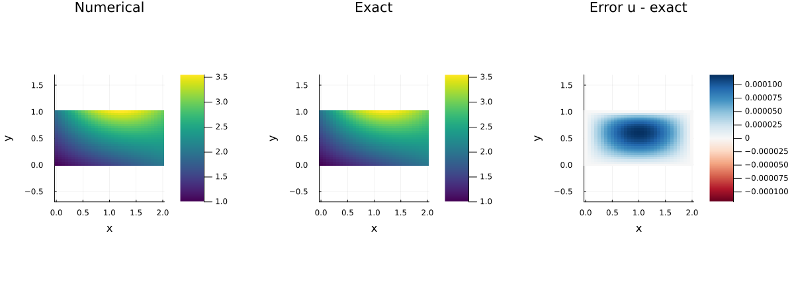
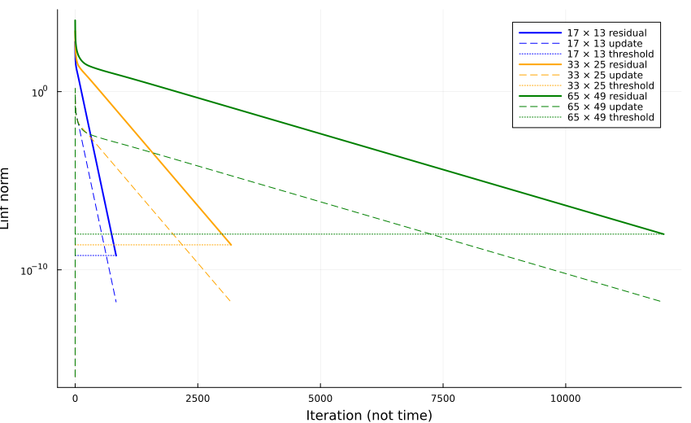
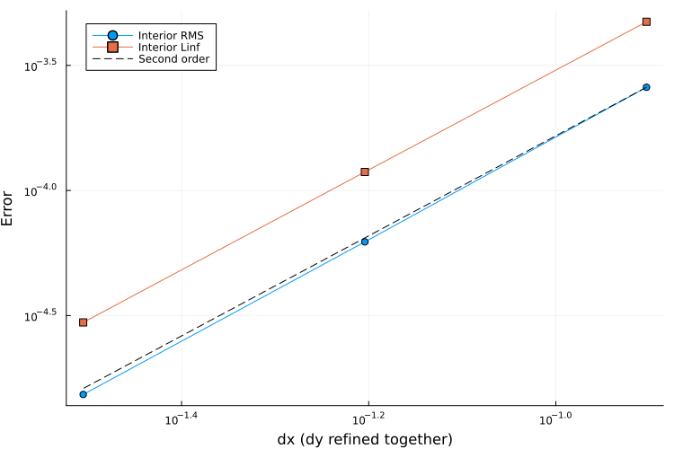

::: {.course-position}
第10回・課題 · 内容ID: N08 · 提出単位: N08-N09
:::



## 定式化と実装条件 {#formulation}

### 必修と授業内の到達点 {#必修と授業内の到達点}

N08で取り組む方程式は，二次元のLaplace方程式
$$
\Delta u=\frac{\partial^2 u}{\partial x^2}
+\frac{\partial^2 u}{\partial y^2}=0.
$$

提出単位は`N08-N09`で，1 branch・1 PR・1学習ログを使います．
[N08授業](../lessons/N08.qmd)と[N09授業](../lessons/N09.qmd)を通して，全辺DirichletのJacobi法でLaplace・Poissonの両方を完成させます．
課題フォルダは[`exercises/N08-N09_laplace_poisson/`](https://github.com/t2lab-it/thermofluid-exercise-student-2026/tree/main/exercises/N08-N09_laplace_poisson)です．
授業内はN08の4関数を実装し，小配列の更新・境界・残差・停止判定を説明できることを目指します．
Poissonの実装，両問題の3格子実験・図・自作2群・考察は，[N09課題](N09.qmd)に従って授業後までに完成させます．



## 編集先とAPI {#api}

[`src/N08N09Elliptic.jl`](https://github.com/t2lab-it/thermofluid-exercise-student-2026/blob/main/src/N08N09Elliptic.jl)の[`ThermofluidExercise.Elliptic`](https://github.com/t2lab-it/thermofluid-exercise-student-2026/blob/main/src/N08N09Elliptic.jl#L1)へ次を実装します．

- [`apply_dirichlet!(u,g)`](https://github.com/t2lab-it/thermofluid-exercise-student-2026/blob/main/src/N08N09Elliptic.jl#L28)
- [`laplace_jacobi_step!(u_new,u_old,dx,dy)`](https://github.com/t2lab-it/thermofluid-exercise-student-2026/blob/main/src/N08N09Elliptic.jl#L36)
- [`laplace_residual!(r,u,dx,dy)`](https://github.com/t2lab-it/thermofluid-exercise-student-2026/blob/main/src/N08N09Elliptic.jl#L44)
- [`residual_converged(rnorm,rinitial;atol=1e-10,rtol=1e-12)`](https://github.com/t2lab-it/thermofluid-exercise-student-2026/blob/main/src/N08N09Elliptic.jl#L52)

[`apply_dirichlet!`](https://github.com/t2lab-it/thermofluid-exercise-student-2026/blob/main/src/N08N09Elliptic.jl#L28)は[冒頭の境界条件](#problem-setup)を適用します．
step／residualは出力配列を返します．
入力検査と，反復を進める[`solve_laplace(u0,g,dx,dy)`](https://github.com/t2lab-it/thermofluid-exercise-student-2026/blob/main/src/N08N09Elliptic.jl#L106)は提供済みです．
停止基準は上の[停止条件](#standard-conditions)を使います．
計算結果の`u`，`converged`，`iterations`，`residual_history`，`update_history`，`threshold`を使って解と反復を確認します．

[`exercises/N08-N09_laplace_poisson/simulate.jl`](https://github.com/t2lab-it/thermofluid-exercise-student-2026/blob/main/exercises/N08-N09_laplace_poisson/simulate.jl)は計算，[`analyze.jl`](https://github.com/t2lab-it/thermofluid-exercise-student-2026/blob/main/exercises/N08-N09_laplace_poisson/analyze.jl)は保存場の解析，[`plot.jl`](https://github.com/t2lab-it/thermofluid-exercise-student-2026/blob/main/exercises/N08-N09_laplace_poisson/plot.jl)は表示，[`run.jl`](https://github.com/t2lab-it/thermofluid-exercise-student-2026/blob/main/exercises/N08-N09_laplace_poisson/run.jl)は一括実行です．
配布済みテストを保持し，[`exercises/N08-N09_laplace_poisson/tests.jl`](https://github.com/t2lab-it/thermofluid-exercise-student-2026/blob/main/exercises/N08-N09_laplace_poisson/tests.jl)の[自作2群](N09.qmd#student-tests)を完成させます．
予想・式・検証結果・考察は，同じフォルダの`learning_log.md`へ書きます．

## 授業内のN08-check {#classroom}

[共通の開始手順](../guides/workflow.qmd#n08-n09-stages)で課題を開始し，4関数を実装したら次を実行します．

```console
$ julia --project=. exercises/N08-N09_laplace_poisson/tests.jl N08-check
```

「N08授業内検証成功」は，N08の4関数の検証が成功したことを表します．
提出時には，[N09課題の完了条件](N09.qmd#completion)に沿って両問題・自作2群・公式12出力を`all`で検証します．

## Laplaceの実験と参照結果 {#reference-results}

[冒頭の問題設定](#problem-setup)と[停止・格子収束の判定条件](#standard-conditions)に従って実験します．
独立に計算した残差を停止閾値と照合し，境界値も確認します．
実行コマンドは[段階別実行](../guides/workflow.qmd#n08-n09-stages)，保存形式は[N09の公式出力](N09.qmd#reference-results)を参照します．

{fig-alt="境界を含む節点格子の数値解と既知解を共通色範囲，誤差をゼロ対称色範囲で比較"}

{fig-alt="3格子の残差，更新量，停止閾値を線種で区別した対数図"}

{fig-alt="内部RMSと最大誤差，2次比較線"}

基準の[summary.toml](../assets/n08-reference/summary.toml)と[plots.toml](../assets/n08-reference/plots.toml)を照合します．
図は[場](../assets/n08-reference/fields.png)・[残差](../assets/n08-reference/residual.png)・[収束](../assets/n08-reference/convergence.png)の単独表示でも確認できます．



## N08-N09の完了条件

両問題の実装・検証・提出は，[N09課題の完了条件](N09.qmd#completion)にまとめています．
N08とN09それぞれの理解度チェック全文をLETUSへ提出します．
