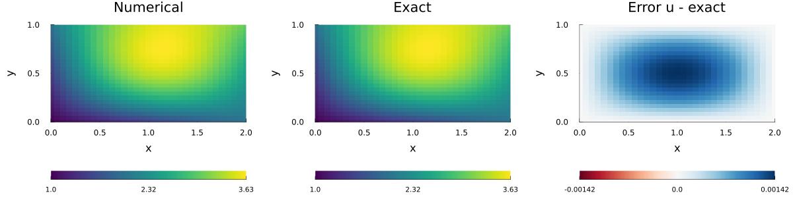
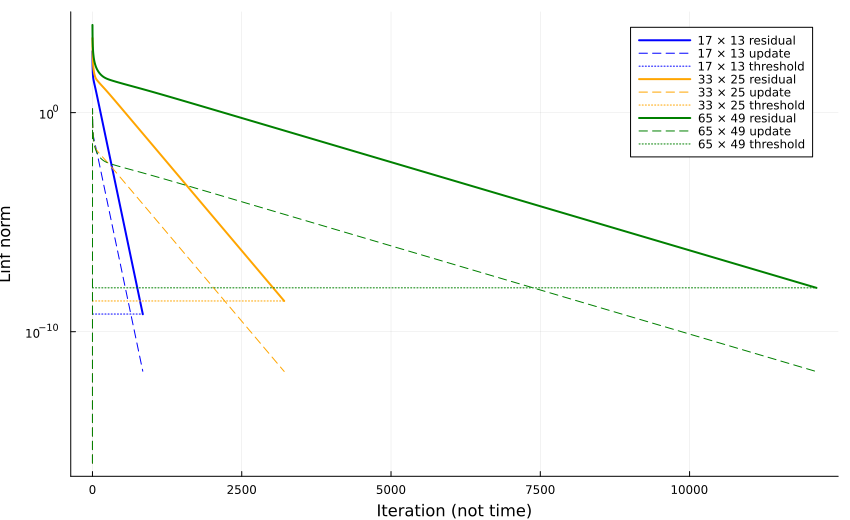
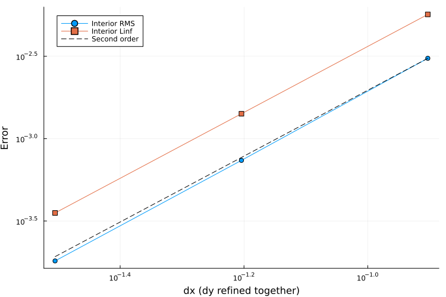

::: {.course-position}
第10回・課題 · 内容ID: N09 · 提出単位: N08-N09
:::

## Poissonへの拡張と課題の完成

[N08](N08.qmd)と同じ提出単位`N08-N09`・課題フォルダ`exercises/N08-N09_laplace_poisson/`を使います．
全辺DirichletのJacobi法でPoissonを実装し，Laplace・Poissonの両方の実験と検証を完成させます．
授業内の検証は[N08-check](N08.qmd#classroom)，提出前の検証は`all`です．

## 編集先とAPI {#api}

`src/N08N09Elliptic.jl`の`ThermofluidExercise.Elliptic`へ次を実装します．

```julia
poisson_jacobi_step!(u_new,u_old,f,dx,dy)
poisson_residual!(r,u,f,dx,dy)
```

[Laplaceの実装](N08.qmd#api)を基に，更新式の$-f$と残差の$+f$を加えます．
$f=0$でLaplaceと一致することを確かめます．
反復を進める`solve_poisson(u0,g,f,dx,dy)`は提供済みで，入力・出力の扱いはN08と共通です．

## 実験と自作2群 {#student-tests}

領域`[0,2]×[0,1]`，節点格子`(17,13),(33,25),(65,49)`，内部0・境界既知値の初期場を使います．
LaplaceのH，PoissonのH+Vと生成項は[公式条件](../lessons/N09.qmd#manufactured)を参照します．
両問題の内部RMS／最大誤差を測り，$p=\log_2(E_{\mathrm{coarse}}/E_{\mathrm{fine}})$の両区間・両誤差で$1.8\le p\le2.2$を確認します．
独立に計算した残差を停止閾値と照合し，境界誤差も確認します．

配布済みテストを保持し，`exercises/N08-N09_laplace_poisson/tests.jl`に次の自作2群を実装します．

1. 非対称小配列・dx!=dyで両問題の1回の更新を手計算と比較し，旧場・全辺と角の保持，f=0での一致を検査する．
2. 両問題の残差停止・解析解誤差・3格子の両区間の約2次収束を検査する．

期待値と許容誤差には，式や手計算に基づく根拠を添えます．
`exercises/N08-N09_laplace_poisson/run.jl`で両問題の出力を生成し，[N05 verify→課題テスト→Pkg.test→check-results](../guides/workflow.qmd#n08-n09-stages)で完成を確認します．
通常の`all`は，両問題・自作2群・公式12出力を検証します．

## 公式12出力 {#reference-results}

`results/N08/`・`results/N09/`にそれぞれ次の6ファイルを保存します．

| ファイル | 内容 |
|---|---|
| `fields.h5` | 3格子の最終場・条件・反復履歴 |
| `summary.toml` | 独立残差・境界誤差・解析解誤差・次数 |
| `fields.png` | 数値解・既知解・誤差 |
| `residual.png` | 残差・更新量・停止閾値 |
| `convergence.png` | 3格子の誤差と2次比較線 |
| `plots.toml` | 図と入力のhash |

`u[i,j]`はx,y順，外部HDF5のデータ空間はy,x順で，図はxを横軸，yを縦軸にします．
両問題は`all`で生成し，共通のrun_idを使います．
再解析・再作図の前後で`fields.h5`のSHA-256を照合します．
容量は1ファイル5 MiB，1内容ID10 MiB，全課題100 MiBで，発展や追加ファイルも含みます．

{fig-alt="境界を含む節点格子の数値解と既知解を共通色範囲，誤差をゼロ対称色範囲で比較"}

{fig-alt="3格子の残差，更新量，停止閾値を線種で区別した対数図"}

{fig-alt="内部RMSと最大誤差，2次比較線"}

基準の[summary.toml](../assets/n09-reference/summary.toml)と[plots.toml](../assets/n09-reference/plots.toml)を照合します．
図は[場](../assets/n09-reference/fields.png)・[残差](../assets/n09-reference/residual.png)・[収束](../assets/n09-reference/convergence.png)の単独表示でも確認できます．

## 任意発展 {#extensions}

Neumann・Gauss–Seidel・SORは，任意に取り組む発展です．

- `extensions/neumann.jl`：可解条件，重み付き平均0，ゴースト消去，緩和更新と残差を実装する．APIは`neumann_jacobi_step!`・`neumann_residual!`・`solve_neumann`，標準omega=2/3．
- `extensions/relaxation.jl`：`gauss_seidel_step!`・`sor_step!`を実装し，同じPoisson問題をomega=1と1.5で比較する．

[Neumannの数式と二段階の実験](../lessons/N09.qmd#neumann)に沿って，混合境界から純Neumannへ進みます．
`mixed_poisson_zero_flux`では$u=x^2,f=2$へ収束することを確認します．
純Neumannの公式解は重み付き平均0とし，別配列の一点固定への定数移動を，全節点残差・法線微分・同じ基準の既知解で比較します．
DCT-Iのk=0モードは可解条件と定数自由度の説明に使います．
[発展の独立コマンド](../guides/workflow.qmd#n08-n09-extensions)でテスト・計算し，出力は`results/N09/extensions/neumann/`・`relaxation/`へ保存します．



## 完了条件 {#completion}

- Laplace・Poissonの公式12出力を作り，境界・独立残差・停止・解析解誤差・3格子の両区間・来歴・容量を検証する．
- 配布済みテスト・自作2群・進捗連動テストが成功する．
- 更新量と残差，生成項の符号，境界，反復誤差と格子誤差を式・コード・結果で説明する．
- 学習ログを完成し，N08とN09それぞれの理解度チェック全文をLETUSへ提出する．
