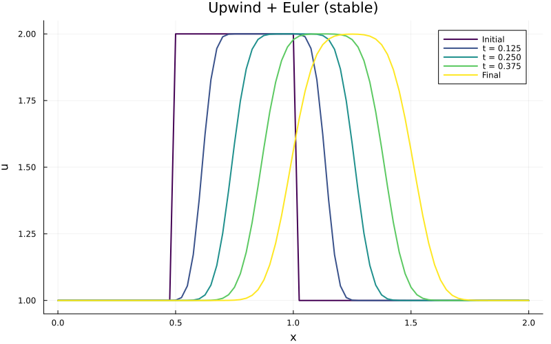
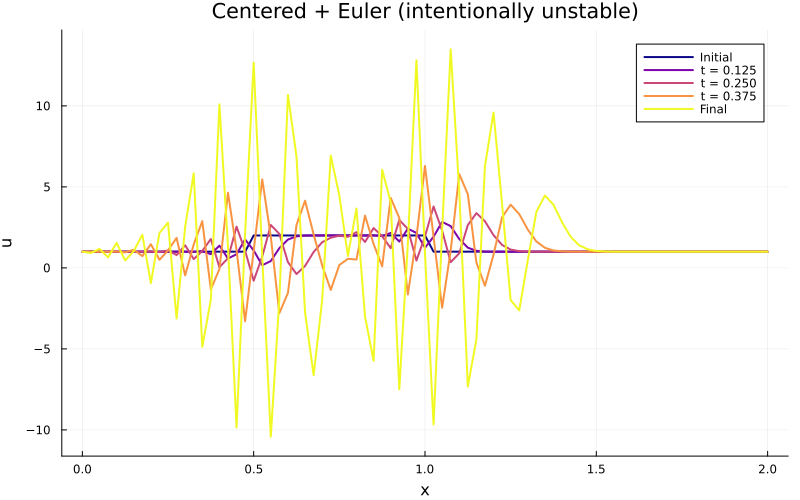

::: {.course-position}
参照・テストと数値検証
:::

このページは、各課題でテストの意味や数値計算結果の妥当性を確認するときに参照するガイドです。具体例、数学的性質、失敗条件、図、単位、符号、範囲、CFLを組み合わせて判断します。

## 実行するコマンド

学生リポジトリのルートディレクトリで、配布環境を復元してから全テストを実行します。

```bash
julia --project=. -e 'using Pkg; Pkg.instantiate()'
julia --project=. -e 'using Pkg; Pkg.test()'
```

`Pkg.test()`は現在課題と前提課題だけを選びます。まだ開始していない将来課題の学生TODOを原因に、現在課題が失敗することはありません。

## 三種類の確認

1. **具体例**: 手計算できる少数の入力で式と添字を確認する。
2. **性質**: 定数保存、有界性、入力不変、最終時刻など複数入力に共通する意味を確認する。
3. **失敗条件**: `NaN`、空配列、不正なCFLなど、契約外の入力が明示的に拒否されることを確認する。

テストがpassしただけで物理的に正しいとは限りません。図、単位、符号、最小・最大、CFLと併せて判断します。

## 学生テスト

各`test/student/ID.jl`にはsmoke TODOがあります。課題を開始したら、教材例の単純な写しではない代表例へ置き換えます。学習ログには入力、期待値の根拠、そのテストが保証することと保証しないことを書きます。

## 1次元線形移流課題の公式出力

この1次元線形移流課題（課題ID: N01）の`main`はPNG二つとTOML summaryを生成します。ファイル名だけでなく、次を確認します。

- 上流差分法の最小・最大が初期範囲内か
- 中心差分法 + Euler法にオーバーシュートまたはアンダーシュートがあるか
- `isapprox(steps * dt, t_final; atol=100eps())`で、丸め誤差の範囲内で最終時刻へ到達するか
- 実効CFLが`c * dt / dx`か
- PNGが開け、summaryの値が実行結果と一致するか

### 公開基準値と比べる

まず、最小値と最大値の**符号**、初期値に対する**範囲**、オーバーシュート・アンダーシュートの**フラグ**を比べます。小数の完全一致はその後に確認します。これにより、計算方法や境界条件の大きな違いを、丸め誤差の違いと混同しにくくなります。

次の値は、公開基準値の`nx=81`、`dx=0.025`、`cfl=0.5`、`dt=0.0125`、`steps=40`に対応する値です。別のパラメータで実行した結果に、この小数をそのまま要求しません。

| Method | minimum | maximum | overshoot | undershoot |
|---|---:|---:|---:|---:|
| upwind + Euler | 1.0 | 1.9993204517450067 | 0.0 | 0.0 |
| centered + Euler | -10.420010468371677 | 13.492726642559711 | 11.492726642559711 | 11.420010468371677 |

{fig-alt="初期値と上流差分法 + Euler法の最終値を比較したグラフ"}

{fig-alt="初期値と中心差分法 + Euler法の最終値を比較し、振動を示したグラフ"}

表の真偽フラグを含む機械可読な値は[`summary.toml`](../assets/n01-reference/summary.toml)でも確認できます。

## 失敗時の切り分け

最初のfailureまたはerrorから読みます。次を秘密情報を除いて記録してください。

- 実行した完全なコマンド
- JuliaとOS
- 最初に失敗したテストセット、期待値、実際値
- 直前に変更したファイルの`git diff`

AIをデバッグ補助に使う場合も、解釈と採否は自分で決め、学習ログへ残します。

## 公開サイト側の検証

教材開発者は公開教材リポジトリで次を実行します。

```bash
julia --project=. test/runtests.jl
julia --project=. scripts/verify_contracts.jl assignments/contracts.toml PUBLIC_ROOT STUDENT_ROOT
QUARTO_JULIA_PROJECT=. quarto render
```

`PUBLIC_ROOT`と`STUDENT_ROOT`には対象checkoutの絶対パスを渡します。検証器は5つの課題ID、パス、開始コマンド、canonical backlink、navigationを照合します。
