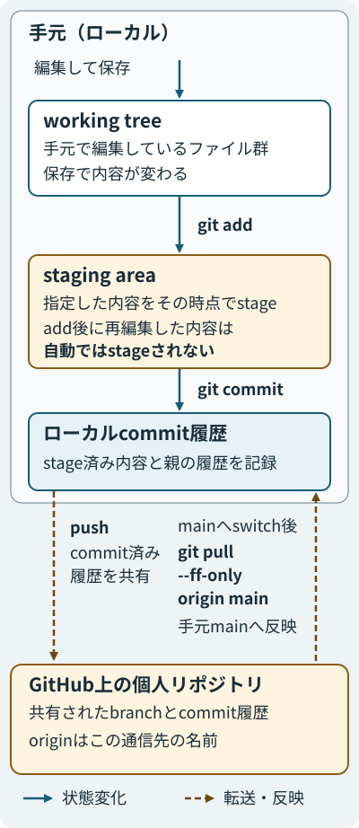
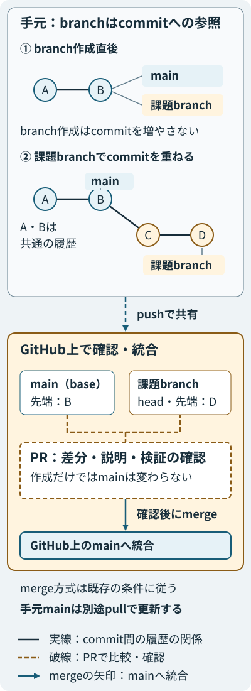

::: {.course-position}
第2回・授業 1/2 · 課題ID: F01
:::

## この回の到達点

- working tree，commit，branch，remote，pull requestの関係を説明できる．
- ローカルテスト，GitHub Actions，diff，セルフレビューがそれぞれ何を確かめるかを区別できる．

## 変更と履歴の区別

ファイルの保存，commit，GitHubへの共有は，それぞれ異なる状態の変化です．

| 用語 | 意味 |
|---|---|
| working tree | 手元で編集しているファイル群 |
| staging area | 次のcommitに含める変更を選んだ状態 |
| commit | 選んだ内容と親の履歴を記録したもの |
| branch | 一連の変更を進めるcommitへの参照．commitを重ねると先端が進む |
| remote | 履歴を共有する相手のリポジトリ．`origin`はその名前の一つ |
| pull request（PR） | branch間の差分を示し，統合前に説明と確認を行う場所 |
: {tbl-colwidths="[22, 78]"}

{#fig-git-change-lifecycle fig-alt="手元では保存がworking treeを変更し，git addがその時点の指定内容をstageし，git commitがstage済み内容を履歴に記録する．add後の再編集は自動ではstageされない．pushはcommit済み履歴をGitHub上の個人リポジトリへ共有し，mainへswitch後のgit pull --ff-only origin mainはGitHub側の更新を手元mainへ反映する"}

例えば挨拶の文字列を編集して保存すると，working treeの内容が変わります．
`git add`は指定した内容をその時点でstageし，通常の`git commit`はstage済みの内容をローカル履歴へ記録します．
add後に再編集した内容は自動ではstageされないので，`git diff`で作業中の変更，`git diff --cached`で次のcommitに含まれる変更を確認します．
図の実線の矢印は状態変化を示し，addやcommitによって作業中のファイルが別の場所へ移動するわけではありません．

破線の矢印は履歴の転送・反映の方向を示します．
pushはcommit済み履歴をremoteへ共有し，未commitの内容を直接送る操作ではありません．
`origin`はGitHub上の個人リポジトリという通信先に付けた名前です．
GitHub側でmergeした結果は，`git switch main`の後に`git pull --ff-only origin main`で取得し，手元の`main`とファイルへ反映します．
実際の操作は[学習ログ・diff・commit](../guides/workflow.qmd#commit)，[push・PR](../guides/workflow.qmd#submit-pr)，[merge後のmain更新](../guides/workflow.qmd#after-merge)を参照してください．

## branchとPRによる確認単位

課題ごとのbranchは，確認済みの`main`から一まとまりの変更を区別するために使います．

{#fig-git-branch-pr-merge fig-alt="branch作成直後はmainと課題branchが同じcommit Bを指し，AとBの履歴を共有する．課題branchでCとDをcommitすると課題branchの参照だけがDへ進む．push後にGitHub上の課題branchをhead，mainをbaseとするPRで確認し，mergeでGitHub上のmainへ統合する．PR作成だけではmainは変わらず，手元mainの更新には別途pullが必要"}

図の丸はcommit，branch名のラベルはそのbranchの先端commitへの参照です．
branchを作った直後は`main`と課題branchが同じcommitを指し，分岐前の履歴は共通しています．
課題branchでcommitを重ねると，課題branchの参照が新しいcommitへ進みます．
丸を結ぶ実線は履歴の関係を示し，Git内部の親参照の向きを示す矢印ではありません．

課題のcommitをpushした後，GitHub上の課題branchをhead，`main`をbaseとしてPRを作成します．
PRの差分と説明を読むと，何を変更し，どんな根拠で統合できると判断したかを確認できます．
変更前後の比較が`diff`です．
変更されたファイルと内容が，課題の目的に合っているかを確認します．
図のPRの破線は比較・確認を示し，PRを作成しただけでは`main`は更新されません．
確認後のmergeがGitHub上の`main`へ統合する操作であり，手元の`main`更新は別の操作です．
図はmerge後のcommitの形を指定せず，mergeの条件と次の課題へ進む手順は[課題ワークフロー](../guides/workflow.qmd#submit-pr)に従います．

## 各確認が示す証拠

| 確認 | 分かること | 限界 |
|---|---|---|
| ローカルテスト | 手元のコードが用意された入力と判定を満たすか | 未commitの変更も含み，未検証の条件までは保証しない |
| GitHub Actions | 共有したcommitがCIの環境でテストを通るか | 手元だけにある変更や，説明の妥当性は確認できない |
| diff | 実際に変更されたファイルと内容 | その変更が正しく動くかは実行結果と照合する必要がある |
| セルフレビュー | 実装・テスト・結果・説明が課題の意図と一致するか | テストや実行による証拠も併せて必要になる |
: {tbl-colwidths="[18, 39, 43]"}

このため，手元で実装とテストを確かめてから共有し，共有した差分とActionsの結果を確認して統合する，という順序に意味があります．
実際の操作と提出条件は[F01課題](../assignments/F01.qmd)，共通のコマンドは[課題ワークフロー](../guides/workflow.qmd)にあります．

[F01課題の理解度チェック](../assignments/F01.qmd#understanding-check)で，この授業の内容を確認してください．
