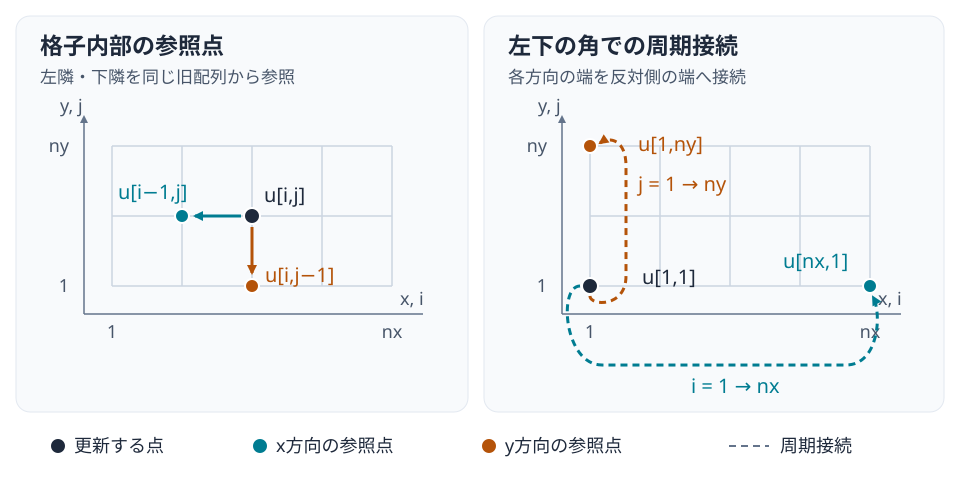

::: {.course-position}
第8回・授業 · 内容ID: N06
:::

## 問題と公式条件 {#problem-setup}

[N05](N05.qmd)の共通APIを使い，無次元スカラーの二次元線形移流を解きます．
実装・テスト・提出物は[N06課題](../assignments/N06.qmd)で確認します．

$$
\frac{\partial u}{\partial t}+c_x\frac{\partial u}{\partial x}
+c_y\frac{\partial u}{\partial y}=0,
\qquad (x,y)\in[0,2)\times[0,1).
$$

| 項目 | 公式条件 |
|---|---|
| 一定速度・安定余裕 | `cx=1.0, cy=0.5, safety=0.8` |
| 両方向の境界 | 周期境界，周期終点の重複なし |
| 格子数 `(nx,ny)` | `(40,30)`，`(80,60)`，`(160,120)` |
| 格子幅 | `dx=2/nx`，`dy=1/ny` |
| 最終時刻・保存時刻 | `t_final=1`，`[0,0.25,0.5,0.75,1]` |
| 代表表示 | `(80,60)` |

初期値と解析解を次のように定めます．

$$
u_0(x,y)=1+0.2\sin(\pi x)+0.3\cos(2\pi y)+0.1\sin(\pi x+2\pi y),
$$
$$
u_{\mathrm{exact}}(x,y,t)=u_0\bigl(\operatorname{mod}(x-c_xt,2),
\operatorname{mod}(y-c_yt,1)\bigr).
$$

解析解は初期分布を両方向に平行移動したものです．
数値解で振幅が小さくなる場合，解析解と比較して数値拡散を読み取ります．

## 配列軸と周期端 {#grid}

Julia配列`u[i,j]`は座標`x[i],y[j]`に対応します．
第1添字がx方向，第2添字がy方向です．
`x=(0:nx-1)*dx`，`y=(0:ny-1)*dy`なので，右端と上端の周期終点は配列に含みません．

{fig-alt="横軸がxと添字i，縦軸がyと添字jの非正方格子．左隣iマイナス1と下隣jマイナス1を参照し，iが1ならnx，jが1ならnyへ周期的に戻る"}

左端の左隣は`nx`，下端の下隣は`ny`です．
角でも二つの周期隣接点を同じ旧配列から読みます．
非正方格子と非対称な値を使うと，x/yや`dx`/`dy`の取り違えを発見できます．

## 二方向の更新と合成CFL {#stability}

非負速度に対して，一次精度の風上差分を二方向に適用します．

$$
u_{i,j}^{n+1}=u_{i,j}^n
-C_x(u_{i,j}^n-u_{i-1,j}^n)
-C_y(u_{i,j}^n-u_{i,j-1}^n),
\quad C_x=\frac{c_x\Delta t}{\Delta x},\quad C_y=\frac{c_y\Delta t}{\Delta y}.
$$

旧値の係数は`1-Cx-Cy`なので，安定条件は二方向の寄与を合わせた`Cx+Cy <= 1`です．
両方向の個別上限の最小値では，この係数が負になる場合があります．

$$
\Delta t_{\max}=\frac{\mathrm{safety}}{c_x/\Delta x+c_y/\Delta y},
\qquad 0<\mathrm{safety}\le1.
$$

例えば`cx=1, cy=0.75, dx=0.5, dy=0.25, safety=0.8`では上限は`0.16`です．
一方の速度が0ならその方向の寄与は消えます．
全点の更新値を`u_new`へ書いてから，旧・新バッファを交換します．

## 時間更新と保存場 {#saved-fields}

二重バッファは時間更新の作業領域であり，保存時刻の瞬時場は独立したデータです．
同じ配列への参照だけを保存すると，過去の時刻の場まで最後の値になります．
各保存区間に`fit_timestep`を適用し，刻みを区間長へ合わせて補間せずに保存します．

`simulate.jl`が場をHDF5へ保存し，`analyze.jl`が場から診断値を求め，`plot.jl`が図を作ります．
保存場があれば，数値計算を再実行せずに解析項目や表示設定を変えられます．
SHA-256は解析・作図が参照したファイルを識別し，違う計算の結果の混入を検出するために使います．

HDF5には条件，座標，保存時刻，場，実効刻み，ステップ数を保存します．
Juliaの`U[i,j,k]`は形状`(nx,ny,nt)`であり，HDF5データ空間の形状`(nt,ny,nx)`，軸宣言`time,y,x`に対応します．
C系の読み手は`U[k,j,i]`で同じ物理点を読みます．
座標・時刻・場・区間刻みの単位属性`units="1"`は無次元を示します．

## 保存量・誤差・必修の格子収束 {#convergence}

周期境界では，離散積分`mass=dx*dy*sum(u)`が丸め誤差の範囲で保存されます．
保存は必要な確認ですが，誤った方向へ移動する解も保存し得るため，解析解の誤差と組み合わせます．

$$
E_{L2}=\sqrt{\frac{\Delta x\Delta y}{L_xL_y}
\sum_{i,j}(u_{i,j}-u_{\mathrm{exact},i,j})^2},
\qquad E_{L\infty}=\max_{i,j}|u_{i,j}-u_{\mathrm{exact},i,j}|.
$$

両軸の格子幅を同時に半分にした3格子を使い，最終時刻のL2誤差から`p=log2(E_coarse/E_fine)`を求めます．
誤差が単調減少し，二つの区間で`0.8 <= p <= 1.2`となることを確かめます．
初期時刻の誤差0から次数を求めません．
標準条件の基準計算では誤差は約`0.0458669, 0.0240646, 0.0123328`，次数は約`0.93054, 0.96441`です．

保存場からは平均・最小値・最大値・空間分散も求められます．
空間分散は各時刻の`mean((u-mean(u)).^2)`に相当し，時間平均とは異なります．
保存されなかった時刻での極値は，この5枚の場だけでは判定できません．
